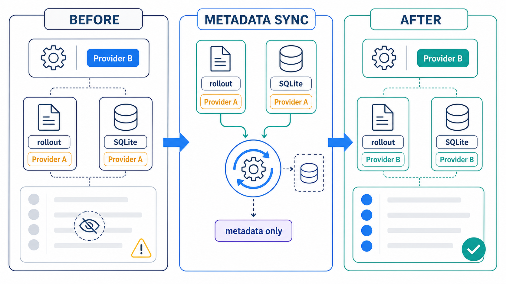
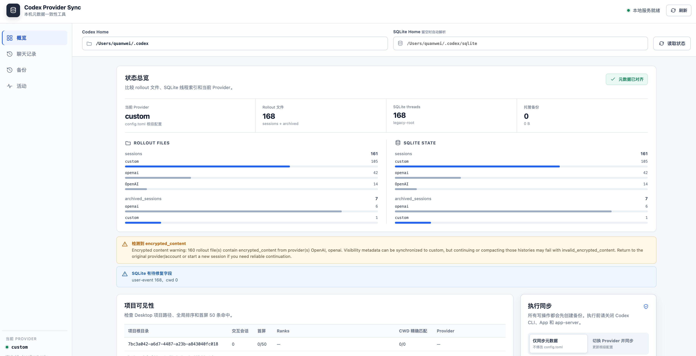
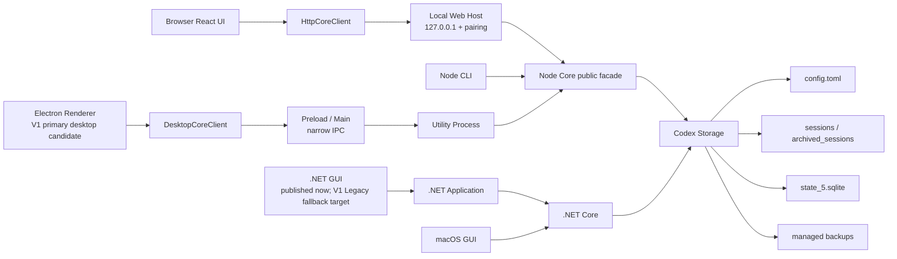

<div align="center">

# codex-provider-sync

### 切换 Provider 后，让 Codex 历史会话重新可见

[](https://github.com/Dailin521/codex-provider-sync/actions/workflows/ci.yml)
[](https://www.npmjs.com/package/@dailin521/codex-provider-sync)
[](https://github.com/Dailin521/codex-provider-sync/releases/latest)
[](LICENSE)
[](https://linux.do/)

**中文** · [English](docs/README_EN.md) · [日本語](docs/README_JA.md) · [한국어](docs/README_KO.md)

</div>

## 它解决什么

切换 `model_provider` 后，旧会话可能从 Codex Desktop 或 `/resume` 中消失。**数据通常仍在磁盘上**，只是会话文件和 SQLite 索引中的 Provider 信息没有同步。

本工具会同步会话文件和 SQLite 索引，恢复会话可见性，并在写入前创建备份。它不负责登录、账号切换，也不修改 `auth.json` 或消息正文。

<p align="center">
  
</p>

### 什么时候需要同步？

- **通常情况：**在官方 OpenAI 与自定义中转之间切换。官方固定使用 `openai`，Provider ID 会发生变化，需要同步历史。
- **已有历史混用：**旧会话已经记录为不同的 Provider ID，需要同步到当前 Provider。
- **无需同步：**只在共用同一 Provider ID 的自定义中转之间切换，或者 CCSwitch 等工具已经同步了历史。

## 快速开始

> CLI/Web 与当前 Windows GUI 独立发布，版本号可能不同。
>
> **V1 候选定位：**本 PR 按 C10 将 Electron 标记为新版主桌面端候选，将保留的 .NET Windows/macOS 实现标记为交接后的 Legacy fallback。**公开发行状态另计：**当前 Releases 仍只提供 Windows .NET GUI；Electron 尚未合入 `main`、未发布、未签名，也不是当前可下载或自动更新的产品。候选角色不表示 Electron 已经公开替代 .NET。

| 场景 | 推荐入口 |
| --- | --- |
| Windows 桌面 | [下载当前公开 Windows GUI（.NET）](https://github.com/Dailin521/codex-provider-sync/releases/latest) · [`V1` Electron 主桌面端候选说明（尚无公开下载）](docs/README_DESKTOP_ZH.md) |
| macOS 桌面 | [本地 Web UI（需 CLI）](#本地-web-ui)；[原生 GUI 构建说明](docs/README_MAC_GUI_ZH.md) |
| 需要浏览器界面或跨平台使用 | [本地 Web UI（需 CLI）](#本地-web-ui) |
| 脚本、CI 或 WSL | [CLI](#cli) |

### 当前公开 Windows GUI（.NET；V1 候选中的 Legacy fallback）

从 [Releases](https://github.com/Dailin521/codex-provider-sync/releases/latest) 下载 `CodexProviderSync.exe`：

1. 点击“刷新”。
2. 选择目标 Provider。
3. 点击“立即同步”。

程序未做代码签名，Windows 可能显示安全警告。请只从本项目 Releases 下载。

[Windows GUI 完整说明](docs/README_GUI_ZH.md)

新版 Electron 主桌面端候选的能力、安全边界和内部验收方式见 [Electron 主桌面端候选说明](docs/README_DESKTOP_ZH.md)。候选角色不等于公开发行；该说明不提供下载，也不构成发布授权。

### 本地 Web UI

本地 Web UI 由 CLI 提供。安装 Node.js `16.20.2+` 后，安装本项目官方 npm 包并启动：

```bash
npm install -g @dailin521/codex-provider-sync
codex-provider web
```

<p align="center">
  <a href="images/README/2026-08-05T03-53-48.708Z.png"></a>
</p>

常用选项：

```bash
codex-provider web --no-open       # 不自动打开浏览器
codex-provider web --port 8792     # 指定端口
codex-provider web --reset-access  # 重新配对浏览器
```

Web UI 默认只监听 `127.0.0.1`，并自动打开浏览器完成配对。共享 React 界面通过版本化 `HttpCoreClient` 调用本地 Web Host；存储路径由服务端 Profile 管理，Sync、Switch 与 Restore 均先显示计划再确认。

#### 切换 Provider 后同步历史

1. 使用 CCSwitch 等常用工具切换 Provider。
2. 在“概览”检查当前 Provider 与两侧分布。
3. 进入“同步”，生成计划并确认执行。
4. 显示“Provider 元数据已对齐”即完成。

> **注意：** 元数据同步只能恢复历史可见性。跨供应商继续旧会话时，目标后端可能无法解密会话中的 `encrypted_content` 推理内容，导致继续对话或压缩（compact）失败。

[Web UI 完整说明](docs/README_WEB_UI_ZH.md)

### CLI

CLI 支持 Node.js `16.20.2+`。安装 Node.js 后，安装本项目官方 npm 包：

```bash
npm install -g @dailin521/codex-provider-sync
codex-provider status
codex-provider sync
```

| 命令 | 用途 |
| --- | --- |
| `codex-provider status` | 检查 Provider、rollout 和 SQLite 状态 |
| `codex-provider sync` | 同步到当前 Provider |
| `codex-provider switch <provider-id>` | 切换 Provider 后同步 |
| `codex-provider restore <backup-dir>` | 恢复备份 |
| `codex-provider watch` | 监听配置和 SQLite 变化 |

`switch` 默认会在目标 Provider section 定义了 `model` 时同步根级 `model`。使用 `--keep-root-model` 保留当前值，或使用 `--model <name>` 显式指定。

有限命令可使用 `--json` 供自动化读取。stdout 只输出一个 schema v1 终态对象，进度和运行时诊断进入 stderr；JSON Mode 使用 `0/1/2/3/4/5/130` 细分退出码，Human Mode 继续保持既有 `0/1` 行为。例如：

```bash
codex-provider status --json
codex-provider sync --json
codex-provider switch openai --json
```

`watch` 和 `web` 是长运行命令，当前不支持单文档 JSON Mode；传入 `--json` 会在启动 watcher/server 前返回结构化输入错误。完整合同见 [CLI 命令兼容合同](docs/architecture/contracts/CLI_CONTRACT_ZH.md)。

普通同步会自动优先采用等长 Provider 原地更新；Provider 长度不同时照常走完整模式，不要求修改 Provider 命名。明确只需要同步 Provider 时，可使用 `sync --fast` / `switch <provider-id> --fast`：它只读取 rollout 首行并保留根模型和历史模型；若某个待改文件不能原地更新，会在任何业务写入前提示改用完整同步，不会偷偷回退。Web 与新版 Electron 桌面端通过共享 Core 提供相同的模式选择。详见 [ADR-0015](docs/adr/0015-provider-byte-updates-and-fast-sync.md)。

SQLite Home 解析顺序：`--sqlite-home` → `config.toml` 根级 `sqlite_home` → `CODEX_SQLITE_HOME` → `<Codex Home>/sqlite`。只有默认布局会回退到 `<Codex Home>/state_5.sqlite`。

## 当前架构



- Web UI 的业务请求经 `HttpCoreClient → /api/core → Node Core public facade`；CLI 直接调用同一公开 Core 边界，不解析彼此的人类输出。
- `V1` 新版 Electron 主桌面端候选经 `DesktopCoreClient → 窄 Preload/Main IPC → Utility Process → Node Core`，Renderer 不接触 Node、任意路径或通用 IPC。
- Windows GUI 通过 Application 层调用 .NET Core；macOS GUI 当前直接调用 .NET Core。
- Node 服务和 .NET Core 处理相同的配置、rollout、SQLite 和备份安全边界。

`V1` 候选按 C10 携带“Electron 新版主桌面端 / .NET Legacy fallback”的交接目标；.NET 仍可构建、测试并至少保留两个维护周期。当前公开 Releases 仍是 .NET，Electron 尚未合入、发布或签名。不得把候选中的角色标识表述成已经发生的公开入口切换；后续发布门槛见 [vNext 分阶段迁移执行索引](docs/migration/VNEXT_MIGRATION_EXECUTION_INDEX_ZH.md)。

## 安全边界

- 每次 `sync` / `switch` 前备份到 `<Codex Home>/backups_state/provider-sync/<timestamp>`；使用默认 Codex Home 时即为 `~/.codex/backups_state/provider-sync/<timestamp>`。
- 不修改消息正文、会话标题、认证信息、`auth.json` 或 `updated_at`。
- SQLite 被占用时，请关闭 Codex、Codex App 和 app-server 后重试。
- 活跃会话锁住 rollout 时，其余文件继续处理；结束会话后再次同步即可。
- 跨 Provider/account 继续旧会话时，目标后端可能无法解密 `encrypted_content`，导致继续对话或 compact 失败；遇到这种情况请切回原 Provider/account，或新建会话。
- Windows 不能直接写入 WSL UNC SQLite Home；请进入 WSL 并使用 Linux 路径运行 CLI。

## 文档

- [vNext 架构基线（Electron + Node 单核心）](docs/VNEXT_ELECTRON_NODE_ARCHITECTURE_ZH.md)
- [vNext 分阶段迁移执行索引](docs/migration/VNEXT_MIGRATION_EXECUTION_INDEX_ZH.md)
- [AI / Agent 操作指南](AGENTS.md)
- [Windows GUI](docs/README_GUI_ZH.md)
- [V1 Electron 主桌面端候选说明](docs/README_DESKTOP_ZH.md)
- [Web UI](docs/README_WEB_UI_ZH.md)
- [English](docs/README_EN.md) · [日本語](docs/README_JA.md) · [한국어](docs/README_KO.md)
- [macOS GUI：中文](docs/README_MAC_GUI_ZH.md) · [English](docs/README_MAC_GUI_EN.md)
- [工作原理](docs/WORKING_PRINCIPLE_ZH.md) · [更新日志](CHANGELOG.md) · [贡献指南](CONTRIBUTING.md)

## 开发

```bash
npm ci
npm run web:build
npm run web:start
npm test
dotnet test desktop/CodexProviderSync.Core.Tests/CodexProviderSync.Core.Tests.csproj
```

npm 包发布维护流程见 [npm 发布维护指南](docs/NPM_PUBLISHING.md)。CLI/Web 包可以独立发布，不要求同步创建 Windows GUI Release。

## 致谢

感谢 [@tangquanwei](https://github.com/tangquanwei) 提出并实现本地 Web UI，贡献聊天记录浏览和多语言文档基础，并通过 [PR #80](https://github.com/Dailin521/codex-provider-sync/pull/80) 将其带入 v0.5.0；也感谢所有参与代码、文档、测试和问题调查的贡献者。

[贡献者名单](CONTRIBUTORS.md) · [GitHub Contributors](https://github.com/Dailin521/codex-provider-sync/graphs/contributors)

## License

MIT
