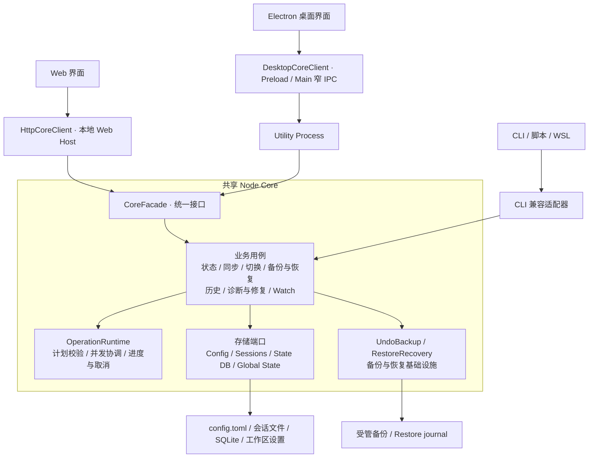

<div align="center">

# codex-provider-sync

### 切换 Provider 后，帮助 Codex 旧会话重新可用

[](https://github.com/Dailin521/codex-provider-sync/actions/workflows/ci.yml)
[](https://www.npmjs.com/package/@dailin521/codex-provider-sync)
[](https://github.com/Dailin521/codex-provider-sync/releases)
[](LICENSE)
[](https://linux.do/)

**中文** · [English](docs/README_EN.md) · [日本語](docs/README_JA.md) · [한국어](docs/README_KO.md)

</div>

## 它解决什么

切换 Provider 后，旧会话可能仍记录着原来的 Provider。本工具将**会话文件与 SQLite 聊天索引中的 Provider 信息**对齐到当前配置，解决元数据不一致的问题。

**不保证跨 Provider / 账号的旧会话一定能继续或压缩**，也不处理登录、认证或加密内容。信息已对齐时，无需重复同步。

<p align="center">
  
</p>

- **已用 CCSwitch 等工具切换**：同步到当前配置中的 Provider。
- **希望在本工具中切换**：修改配置后，同步会话文件和索引中的 Provider。
- **Provider 信息已经一致**：不必重复同步；继续失败时应查看 Codex 的具体报错。

## 核心功能

- **同步与切换**：预览或直接同步，按需开启自动同步。
- **备份与恢复**：修改前自动备份，支持恢复和清理。
- **聊天与日志**：按项目浏览会话，查看操作结果和耗时。
- **存储与修复**：自定义数据位置，按需诊断和专项修复。

## 下载 Windows 桌面版

**Windows x64**，无需 Node.js。

[下载最新正式版：安装版 / 便携 ZIP、版本说明与校验](https://github.com/Dailin521/codex-provider-sync/releases/latest)

未签名。安装版支持下载后确认安装更新；便携版须手动完整解压。1.0.2 修复安装版检查更新立即失败的问题，受影响的 1.0.1 用户需手动安装 1.0.2 一次，详见[升级说明](docs/release-notes/v1.0.2-zh.md)。旧 .NET 版不能通过旧更新按钮迁移。

macOS/Linux Electron 包尚未发布；CLI / Web 的 npm 版本独立发布。

## 日常使用

1. 打开“概览”，确认 **Provider、存储路径和同步状态**。
2. 已通过 CCSwitch 等工具切换 Provider：点击“预览同步”查看影响，或“直接同步”立即执行。
3. 查看结果。部分完成时，结束相关占用会话后重试；需要撤销时进入“备份 / 恢复”。

“单独切换 Provider”会修改配置并同步历史 Provider，不改历史模型；自定义 Provider 需预先配置。

修改前自动备份，默认保留最近 **2 份**，在“备份 / 恢复”中管理；无需修改时不备份，受保护备份不受数量限制。

[桌面完整指南](docs/README_DESKTOP_ZH.md) · [旧版迁移说明](docs/release-notes/v1.0.0-zh.md)

## 本地 Web UI

安装 Node.js `16.20.2+` 后运行，获得 npm 当前已发布的 CLI / Web 版本：

```bash
npm install -g @dailin521/codex-provider-sync
codex-provider web
```

默认只监听本机 `127.0.0.1:8791`，打开浏览器完成配对。跨设备使用见 [Web 指南与 SSH 用法](docs/README_WEB_UI_ZH.md)。

## CLI

安装同一个 npm 包后，先检查，再同步：

```bash
codex-provider status
codex-provider sync
```

CLI 写命令直接执行。切换 Provider、恢复备份、Watch、路径参数及 JSON 退出码见 [CLI 指南](docs/README_CLI_ZH.md)；命令是否可用以安装版本的 `--help` 为准。

## 架构：一个共享核心，多种入口

CLI、Web 与 Electron 共用 **Node Core 的同一套业务用例和存储算法**。桌面版不通过启动 CLI、解析终端文本来执行同步，安装 CLI 也不会额外安装 Electron。



- **界面与 Host** 负责交互、传输和桌面能力，不重复实现 Provider 读写算法。
- **CoreFacade** 是新版 Web `/api/core` 与 Electron 的入口；CLI 及保留的旧 Web 写路由仍通过兼容适配层调用同一业务用例。
- **Sync、Repair、Restore 各司其职**：普通同步只对齐 Provider，专项修复需明确选择，恢复独立保留恢复前快照和补偿机制。
- **旧 .NET Windows/macOS** 是独立的 Legacy 实现，保留构建与兼容维护，不是 Node Core 的另一个分发壳。

模块归属、依赖方向和不可改变的读写约束，以 [当前 Node Core 架构](docs/architecture/NODE_CORE_ARCHITECTURE_ZH.md) 为准；总体路线见 [Electron + Node 架构基线](docs/VNEXT_ELECTRON_NODE_ARCHITECTURE_ZH.md)。

## 同步如何读写，速度取决于什么

普通同步从 `config.toml` 获取当前 Provider，只解析会话首行的 `session_meta`，再对齐会话文件与 SQLite 的 Provider 信息，**不扫描聊天正文来修复其他字段**。

| 文件更新方式 | 适用情况 | 读写行为 |
| --- | --- | --- |
| 等长原地替换 | Provider 的 JSON 字面量 UTF-8 字节等长，且定位、身份及占用校验通过 | 定位覆盖 Provider 字节，保持文件身份、大小和正文不变 |
| 流式替换 | 有效首行不满足原地替换条件，如 Provider 字节长度不同 | 更新首行，逐字节复制正文到临时文件，再原子替换 |

以上策略自动选择，不需要 `--fast`，也不要求用户把 Provider 名称统一成固定长度。原地写失败不会强制退回整文件替换。

**等长不代表整次操作只写几个字节。** 备份、校验、落盘及时间戳恢复仍有开销；大量文件或大体积历史仍可能耗时。概览中的“如何加快同步”提供建议，Windows 操作日志可查看复制、落盘、替换、清理和时间戳恢复的分项耗时。

[工作原理与路径解析](docs/WORKING_PRINCIPLE_ZH.md) · [Provider I/O 不变量](docs/architecture/NODE_CORE_ARCHITECTURE_ZH.md#3-provider-io-不变量必须保持)

## 常见结果与注意事项

- **同步范围**：只对齐 Provider，不修改聊天正文、历史模型或 `threads.updated_at`，不读取或修改 `auth.json`。
- **部分完成**：不代表全部失败，也不会自动全量回滚。查看跳过项、失败阶段和备份，再重试或手动恢复。
- **数据已变化 / 状态待刷新**：手动刷新或重新预览，不要删除锁文件或数据库。
- **文件数与索引数不同**：不一定是故障，以 Provider 分布和同步状态为准。
- **仍无法继续**：若为加密内容或模型兼容问题，请回到原 Provider / 账号，或新建会话；同步不能解决这类问题。
- **存储位置**：以概览实际路径为准。Windows 的 WSL UNC SQLite 路径仅支持诊断；写入需进入对应 WSL 运行 CLI。

备份数量在同一应用内统一管理，各 Codex Home 分别保留；桌面、Web 浏览器与 CLI 不共享偏好。保存数量设置不会立即删除备份。

## 文档与开发

- 用户指南：[桌面中文](docs/README_DESKTOP_ZH.md) / [English](docs/README_DESKTOP_EN.md) · [Web](docs/README_WEB_UI_ZH.md) · [CLI](docs/README_CLI_ZH.md)
- [完整文档索引](docs/README_ZH.md) · [更新日志](CHANGELOG.md) · [反馈问题](https://github.com/Dailin521/codex-provider-sync/issues)
- [工作原理](docs/WORKING_PRINCIPLE_ZH.md) · [当前 Node Core 架构与读写约束](docs/architecture/NODE_CORE_ARCHITECTURE_ZH.md)
- [贡献与构建指南](CONTRIBUTING.md) · [迁移与发布门禁](docs/migration/VNEXT_MIGRATION_EXECUTION_INDEX_ZH.md) · [AI / Agent 指南](AGENTS.md)

源码开发使用 Node 24：

```bash
npm ci
npm run architecture:check
npm test
npm run web:build
npm run desktop:build
```

开发时先读当前架构，再查对应合同、ADR 与测试。构建成功不等于完成所有平台的发布验收。

## 致谢与许可

感谢 [@tangquanwei](https://github.com/tangquanwei) 贡献本地 Web UI、聊天记录浏览和多语言文档基础，并通过 [PR #80](https://github.com/Dailin521/codex-provider-sync/pull/80) 带入 v0.5.0；感谢所有参与贡献和问题调查的朋友。

[贡献者](CONTRIBUTORS.md) · [GitHub Contributors](https://github.com/Dailin521/codex-provider-sync/graphs/contributors) · [LINUX DO 社区](https://linux.do/) · [MIT License](LICENSE)
