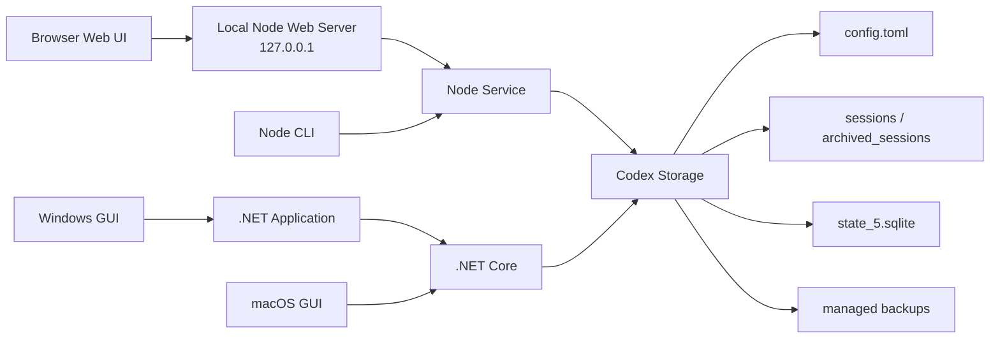

<div align="center">

# codex-provider-sync

### 切换 Provider 后，让 Codex 历史会话重新可见

[](https://github.com/Dailin521/codex-provider-sync/actions/workflows/ci.yml)
[](https://github.com/Dailin521/codex-provider-sync/releases/latest)
[](LICENSE)
[](https://linux.do/)

[**下载 Windows GUI**](https://github.com/Dailin521/codex-provider-sync/releases/latest) · [使用本地 Web UI（需 CLI）](#本地-web-ui)

语言：**中文** · [English](docs/README_EN.md) · [日本語](docs/README_JA.md) · [한국어](docs/README_KO.md)

</div>

## 它解决什么

切换 `model_provider` 后，旧会话可能从 Codex Desktop 或 `/resume` 中消失。数据通常仍在磁盘上，只是会话文件和 SQLite 索引中的 Provider 信息没有同步。

本工具会同步会话文件和 SQLite 索引，恢复会话可见性，并在写入前创建备份。它不负责登录、账号切换，也不修改 `auth.json` 或消息正文。

## 快速开始

| 场景 | 推荐入口 |
| --- | --- |
| Windows 桌面 | [下载 Windows GUI](https://github.com/Dailin521/codex-provider-sync/releases/latest) · [使用说明](#windows-gui) |
| macOS 桌面 | [本地 Web UI（需 CLI）](#本地-web-ui)；[原生 GUI 构建说明](docs/README_MAC_GUI_ZH.md) |
| 需要浏览器界面或跨平台使用 | [本地 Web UI（需 CLI）](#本地-web-ui) |
| 脚本、CI 或 WSL | [CLI](#cli) |

### Windows GUI

从 [Releases](https://github.com/Dailin521/codex-provider-sync/releases/latest) 下载 `CodexProviderSync.exe`：

1. 点击“刷新”。
2. 选择目标 Provider。
3. 点击“立即同步”。

程序未做代码签名，Windows 可能显示安全警告。请只从本项目 Releases 下载。

[Windows GUI 完整说明](docs/README_GUI_ZH.md)

### 本地 Web UI

本地 Web UI 由 CLI 提供。安装 Node.js `16.20.2+` 后，安装本项目官方 npm 包并启动：

```bash
npm install -g @dailin521/codex-provider-sync
codex-provider web
```


常用选项：

```bash
codex-provider web --no-open       # 不自动打开浏览器
codex-provider web --port 8792     # 指定端口
codex-provider web --reset-access  # 重新配对浏览器
```

Web UI 默认只监听 `127.0.0.1`，并自动打开浏览器完成配对。存储路径由页面顶部的存储配置（Profile）管理，写操作需要确认；存储配置发生变化时必须重新确认。

[Web UI 完整说明](docs/README_WEB_UI_ZH.md)

### CLI

CLI 支持 Node.js `16.20.2+`。安装 Node.js 后，安装本项目官方 npm 包：

```bash
npm install -g @dailin521/codex-provider-sync
codex-provider status
codex-provider sync
```

| 命令 | 用途 |
| --- | --- |
| `codex-provider status` | 检查 Provider、rollout 和 SQLite 状态 |
| `codex-provider sync` | 同步到当前 Provider |
| `codex-provider switch <provider-id>` | 切换 Provider 后同步 |
| `codex-provider restore <backup-dir>` | 恢复备份 |
| `codex-provider watch` | 监听配置和 SQLite 变化 |

`switch` 默认会在目标 Provider section 定义了 `model` 时同步根级 `model`。使用 `--keep-root-model` 保留当前值，或使用 `--model <name>` 显式指定。

SQLite Home 解析顺序：`--sqlite-home` → `config.toml` 根级 `sqlite_home` → `CODEX_SQLITE_HOME` → `<Codex Home>/sqlite`。只有默认布局会回退到 `<Codex Home>/state_5.sqlite`。

## 当前架构



- Web UI 和 CLI 使用同一套 Node 服务逻辑。
- Windows GUI 通过 Application 层调用 .NET Core；macOS GUI 当前直接调用 .NET Core。
- Node 服务和 .NET Core 处理相同的配置、rollout、SQLite 和备份安全边界。

## 安全边界

- 每次 `sync` / `switch` 前备份到 `<Codex Home>/backups_state/provider-sync/<timestamp>`；使用默认 Codex Home 时即为 `~/.codex/backups_state/provider-sync/<timestamp>`。
- 不修改消息正文、会话标题、认证信息、`auth.json` 或 `updated_at`。
- SQLite 被占用时，请关闭 Codex、Codex App 和 app-server 后重试。
- 活跃会话锁住 rollout 时，其余文件继续处理；结束会话后再次同步即可。
- 跨 Provider/account 的 `encrypted_content` 可能只能恢复列表可见性。
- Windows 不能直接写入 WSL UNC SQLite Home；请进入 WSL 并使用 Linux 路径运行 CLI。

## 文档

- [AI / Agent 操作指南](AGENTS.md)

- [Windows GUI](docs/README_GUI_ZH.md)
- [Web UI](docs/README_WEB_UI_ZH.md)
- [English](docs/README_EN.md) · [日本語](docs/README_JA.md) · [한국어](docs/README_KO.md)
- [macOS GUI：中文](docs/README_MAC_GUI_ZH.md) · [English](docs/README_MAC_GUI_EN.md)
- [工作原理](docs/WORKING_PRINCIPLE_ZH.md) · [更新日志](CHANGELOG.md) · [贡献指南](CONTRIBUTING.md)

## 开发

```bash
npm ci
npm run web:build
npm run web:start
npm test
dotnet test desktop/CodexProviderSync.Core.Tests/CodexProviderSync.Core.Tests.csproj
```

npm 包发布维护流程见 [npm 发布维护指南](docs/NPM_PUBLISHING.md)。CLI/Web 包可以独立发布，不要求同步创建 Windows GUI Release。

## License

MIT
