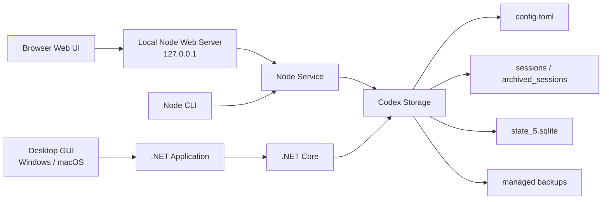

<div align="center">

# codex-provider-sync

### Make Codex history visible again after switching providers

[](https://github.com/Dailin521/codex-provider-sync/actions/workflows/ci.yml)
[](https://github.com/Dailin521/codex-provider-sync/releases/latest)
[](../LICENSE)
[](https://linux.do/)

[Download Windows GUI](https://github.com/Dailin521/codex-provider-sync/releases/latest) · [中文](../README.md) · English · [日本語](README_JA.md) · [한국어](README_KO.md)

</div>

## What it solves

After switching `model_provider`, older sessions may disappear from Codex Desktop or `/resume`. The data usually remains on disk, but provider information in session files and the SQLite index is no longer synchronized.

This tool synchronizes session files and the SQLite index, restoring session visibility and creating a backup before writing. It does not sign in, switch accounts, or modify `auth.json` or message content.

## Quick Start

| Scenario | Recommended interface |
| --- | --- |
| Windows desktop | [Native Windows GUI](#windows-gui) |
| macOS desktop | [Local Web UI](#local-web-ui); [native GUI build guide](README_MAC_GUI_EN.md) |
| Browser interface or cross-platform use | [Local Web UI](#local-web-ui) |
| Scripts, CI, or WSL | [CLI](#cli) |

### Windows GUI

Download `CodexProviderSync.exe` from [Releases](https://github.com/Dailin521/codex-provider-sync/releases/latest):

1. Click Refresh.
2. Select the target provider.
3. Click Sync Now.

The application is not code-signed, so Windows may show a security warning. Download only from this project's Releases.

[Full Windows GUI guide](README_GUI_ZH.md)

### Local Web UI

With the CLI installed, run:

```bash
codex-provider web
```


Common options:

```bash
codex-provider web --no-open       # Do not open a browser automatically
codex-provider web --port 8792     # Use a specific port
codex-provider web --reset-access  # Pair a browser again
```

The Web UI listens on `127.0.0.1` by default and opens a browser to pair automatically. Storage paths are managed by profiles, write operations require confirmation, and confirmation is required again if a profile changes.

[Full Web UI guide](README_WEB_UI_ZH.md)

### CLI

The CLI supports Node.js `16.20.2+`. If it is not installed, run:

```bash
npm install -g git+https://github.com/Dailin521/codex-provider-sync.git
codex-provider status
codex-provider sync
```

| Command | Purpose |
| --- | --- |
| `codex-provider status` | Inspect provider, rollout, and SQLite state |
| `codex-provider sync` | Synchronize to the current provider |
| `codex-provider switch <provider-id>` | Switch provider, then synchronize |
| `codex-provider restore <backup-dir>` | Restore a backup |
| `codex-provider watch` | Watch configuration and SQLite changes |

SQLite Home resolution order: `--sqlite-home` → root-level `sqlite_home` in `config.toml` → `CODEX_SQLITE_HOME` → `<Codex Home>/sqlite`. Only the default layout falls back to `<Codex Home>/state_5.sqlite`.

## Current Architecture



- The Web UI and CLI share the same Node service logic.
- The Windows and macOS GUIs call .NET Core through the Application layer.
- Both paths enforce the same configuration, rollout, SQLite, and backup safety boundaries.

## Safety boundaries

- Before every `sync` or `switch`, a backup is created at `~/.codex/backups_state/provider-sync/<timestamp>`.
- Does not modify message content, session titles, authentication data, `auth.json`, or `updated_at`.
- If SQLite is in use, close Codex, Codex App, and app-server, then retry.
- If an active session locks rollout files, other files continue; sync again after that session ends.
- Across providers or accounts, `encrypted_content` may restore list visibility only.
- Windows cannot write directly to a WSL UNC SQLite Home; enter WSL and run the CLI with Linux paths.

## Documentation

- [AI / Agent Guide](../AGENTS.md)

- [Windows GUI](README_GUI_ZH.md)
- [Web UI](README_WEB_UI_ZH.md)
- [中文](../README.md) · [日本語](README_JA.md) · [한국어](README_KO.md)
- [macOS GUI: 中文](README_MAC_GUI_ZH.md) · [English](README_MAC_GUI_EN.md)
- [How it works](WORKING_PRINCIPLE_ZH.md) · [Changelog](../CHANGELOG.md) · [Contributing](../CONTRIBUTING.md)

## Development

```bash
npm ci
npm run web:build
npm run web:start
npm test
dotnet test desktop/CodexProviderSync.Core.Tests/CodexProviderSync.Core.Tests.csproj
```

## License

[MIT](../LICENSE)
