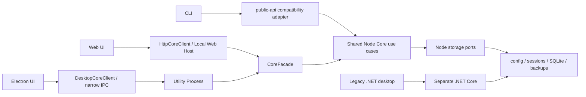

<div align="center">

# codex-provider-sync

### Make Codex history visible again after switching providers

[](https://github.com/Dailin521/codex-provider-sync/actions/workflows/ci.yml)
[](https://www.npmjs.com/package/@dailin521/codex-provider-sync)
[](https://github.com/Dailin521/codex-provider-sync/releases)
[](../LICENSE)
[](https://linux.do/)

[中文](../README.md) · **English** · [日本語](README_JA.md) · [한국어](README_KO.md)

</div>

## What it solves

After switching `model_provider`, older sessions may disappear from Codex Desktop or `/resume`. **The data usually remains on disk**; only the provider information in session files and the SQLite index is out of sync.

This tool aligns Provider metadata in session files and the SQLite index. Actual changes are backed up first, retaining the two most recent managed backups by default; a no-op creates no backup. Desktop/Web manage retention only in Backups / Restore. Operations share the app setting, with a separate pool per Codex Home; Desktop, browsers and CLI do not share preferences. Saving the setting does not immediately delete backups, and recovery-protected backups may exceed the limit. It does not sign in, switch accounts, decrypt or reconstruct messages, or modify `auth.json`.

<p align="center">
  
</p>

### When is synchronization needed?

- **Typical case:** Switching between official OpenAI and a custom relay. Official OpenAI always uses `openai`, so the Provider ID changes and history needs to be synchronized.
- **Existing mixed history:** Older sessions already contain different Provider IDs and need to be aligned with the current provider.
- **No synchronization needed:** Switching only among custom relays that share one Provider ID, or when CCSwitch or another tool has already synchronized history.

## Quick Start

> This guide describes the V1 code: Electron is its primary desktop interface, with .NET retained as Legacy. A local V1 build does not imply public release, signing, or an enabled update channel. Use only assets actually listed in Releases; npm installs the published version. See [delivery status](migration/VNEXT_MIGRATION_EXECUTION_INDEX_ZH.md).

| Scenario | Recommended interface |
| --- | --- |
| Windows desktop | V1 Electron · [User guide](README_DESKTOP_EN.md) · [Published assets](https://github.com/Dailin521/codex-provider-sync/releases) |
| macOS / Linux desktop | [Build and platform guide](README_DESKTOP_EN.md); availability depends on actual assets for that version |
| Browser interface or cross-platform use | [Local Web UI (CLI required)](#local-web-ui) |
| Scripts, CI, or WSL | [CLI](#cli) |

### Desktop app

Use the complete supplied V1 program folder or an available platform package from [Releases](https://github.com/Dailin521/codex-provider-sync/releases). Do not copy only the Electron EXE:

1. Open Overview and check the current Provider and sync status.
2. After switching elsewhere, choose Preview sync to review the impact, or Sync now to execute immediately. Both have the same scope.
3. To change Provider in this app, select the Provider and root-model strategy, review, and confirm.

History groups main chats by project with collapsed subtasks and independent Load more controls. Right-click a chat for ID/resume-command actions or a project to set its local display name. The app also provides logs, storage profiles and advanced diagnostics/repair. Data loads initially or after explicit actions, without background polling. Watch must be enabled explicitly. Updates check once on the first launch each day or manually, without automatic installation.

New Windows operation logs break file updates into copying, flushing, replacement, cleanup and timestamp restoration. Old records have no retroactive timings. Performance work retains backup-first, flushes and file timestamps; synthetic benchmark gains are not promises for a real Home.

[Full desktop guide](README_DESKTOP_EN.md)

### Local Web UI

The Local Web UI is provided by the CLI. Install Node.js `16.20.2+`, then install this project's official npm package and start it:

```bash
npm install -g @dailin521/codex-provider-sync
codex-provider web
```

Common options:

```bash
codex-provider web --no-open       # Do not open a browser automatically
codex-provider web --port 8792     # Use a specific port
codex-provider web --reset-access  # Pair a browser again
```

The Web UI listens on `127.0.0.1` by default and opens a browser to pair automatically. Storage paths are managed by server-side profiles. Sync now authorizes execution on click; Preview sync, Switch, Repair and Restore show a confirmation first. All use Prepare/Apply internally.

#### Synchronize history after switching providers

1. Switch providers with CCSwitch or your usual tool.
2. Check the current Provider and sync status on Overview.
3. Choose Preview sync and confirm, or click Sync now.
4. Inspect the result. For partial completion, end the active session and sync again; skipped records are not updated records.

> **Note:** Metadata sync restores history visibility only. When continuing an old session across providers, the target backend may be unable to decrypt its `encrypted_content` reasoning data, causing continuation or compaction to fail.

[Full Web UI guide (Chinese)](README_WEB_UI_ZH.md)

### CLI

The CLI supports Node.js `16.20.2+`. After installing Node.js, install this project's official npm package:

```bash
npm install -g @dailin521/codex-provider-sync
codex-provider status
codex-provider sync
```

| Command | Purpose |
| --- | --- |
| `codex-provider status` | Inspect provider, rollout, and SQLite state |
| `codex-provider sync` | Synchronize to the current provider |
| `codex-provider switch <provider-id>` | Switch provider, then synchronize |
| `codex-provider diagnostics` | Run one explicit full read-only diagnostic scan |
| `codex-provider repair <targets>` | Explicitly repair models, cwd, user-event, or workspace roots |
| `codex-provider restore <backup-dir>` | Restore a backup |
| `codex-provider watch` | Watch configuration and SQLite changes |

CLI write commands execute without an interactive confirmation. For a review screen, use Desktop or Web. Scripts should use `--json` and inspect the outcome; partial completion exits with code `3`. See the [CLI guide (Chinese)](README_CLI_ZH.md) and [CLI contract](architecture/contracts/CLI_CONTRACT_ZH.md).

By default, `switch` updates the root-level `model` when the target provider section defines one, otherwise preserving it. Use `--keep-root-model` to keep the current value or `--model <name>` to set it explicitly. None of these strategies rewrites historical models; that requires explicit Repair.

`sync` uses the root `model_provider` in `config.toml` (defaulting to `openai`) and only parses rollout headers for its business scan. **Safe Provider IDs with equal-length JSON literal bytes and an unambiguous location are updated in place; other valid headers use streamed temporary replacement.** Both preserve body bytes. Character count is not byte length; users need not rename Providers to a fixed length. There is no `--fast` or `sync --provider` option. See the [Core I/O invariants](architecture/NODE_CORE_ARCHITECTURE_ZH.md#3-provider-io-不变量必须保持).

Models, cwd, user-event flags, workspace roots and encrypted content are outside everyday Sync. Full diagnostics require an explicit read-only `diagnostics` request. `repair` scans only data required by selected `models`, `cwd`, `userEvent` or `workspaceRoots` (which includes cwd). Web/Electron expose these under Advanced features. Sync failures never auto-escalate into diagnostics or repair; record renumbering and history display-index rebuilding are not supported.

SQLite Home resolution order: `--sqlite-home` → root-level `sqlite_home` in `config.toml` → `CODEX_SQLITE_HOME` → `<Codex Home>/sqlite`. Only the default layout falls back to `<Codex Home>/state_5.sqlite`.

## Current Architecture



- Web/Electron use CoreFacade; the CLI retains `src/public-api.js` compatibility adapters that run Prepare/Apply in-process. They share the same ProviderSync and do not parse each other's human output.
- The V1 Electron desktop app uses `DesktopCoreClient → narrow Preload/Main IPC → Utility Process → Node Core`; its Renderer has no Node, arbitrary-path, or generic-IPC access.
- The Windows GUI calls .NET Core through the Application layer; the macOS GUI currently calls .NET Core directly.
- .NET is a separate Legacy implementation. Its historical model-repair, journal and automatic rollback behavior must not be attributed to the current Node Core.

Module ownership, Provider I/O invariants and regression gates are defined in the [current Node Core architecture](architecture/NODE_CORE_ARCHITECTURE_ZH.md). .NET remains buildable and testable; release and migration completion are tracked separately in the [execution index](migration/VNEXT_MIGRATION_EXECUTION_INDEX_ZH.md).

## Safety boundaries

- Actual Sync/Switch/Repair changes are backed up under `<Codex Home>/backups_state/provider-sync/<timestamp>`. Default retention is two; no-op operations create no backup.
- Ordinary writes use the Home lock, native SQLite transactions and UndoBackup, without cross-file journals or automatic full rollback. Post-mutation failure is partial: prepare and retry to converge, or manually Restore. Restore retains its own snapshot, journal and compensation.
- Does not modify message content, session titles, authentication data, `auth.json`, or `updated_at`.
- If SQLite is in use, close Codex, Codex App, and app-server, then retry.
- If an active session locks rollout files, other files continue; sync again after that session ends.
- When continuing an old session across providers or accounts, the target backend may be unable to decrypt `encrypted_content`, causing continuation or compaction to fail. Return to the original provider/account or start a new session.
- Windows cannot write directly to a WSL UNC SQLite Home; enter WSL and run the CLI with Linux paths.

## Documentation

- [Current Node Core architecture and development constraints](architecture/NODE_CORE_ARCHITECTURE_ZH.md)
- [AI / Agent Guide](../AGENTS.md)
- [Legacy .NET Windows GUI guide (Chinese)](README_GUI_ZH.md)
- [CLI guide (Chinese)](README_CLI_ZH.md)
- [V1 Electron desktop guide](README_DESKTOP_EN.md)
- [Web UI guide (Chinese)](README_WEB_UI_ZH.md)
- [中文](../README.md) · [日本語](README_JA.md) · [한국어](README_KO.md)
- [Legacy .NET macOS GUI: 中文](README_MAC_GUI_ZH.md) · [English](README_MAC_GUI_EN.md)
- [How it works (Chinese)](WORKING_PRINCIPLE_ZH.md) · [Changelog](../CHANGELOG.md) · [Contributing](../CONTRIBUTING.md)

## Development

Full workspace development uses Node 24; the installed root CLI still supports Node 16.20.2.

```bash
npm ci
npm run architecture:check
npm run web:build
npm run web:start
npm test
dotnet test desktop/CodexProviderSync.Core.Tests/CodexProviderSync.Core.Tests.csproj
```

`architecture:check` reuses workspace/public-boundary checks and Provider in-place/streamed/Windows-worker regressions. CI runs the same command. Intentional Core behavior changes require an ADR, contracts, tests and user-guide updates; relaxing tests is not a substitute.

Maintainers can publish the CLI/Web package independently of Windows GUI releases. See the [npm publishing guide (Chinese)](NPM_PUBLISHING.md).

## Acknowledgements

Thanks to [@tangquanwei](https://github.com/tangquanwei) for proposing and implementing the Local Web UI, contributing history browsing and the multilingual documentation foundation, and bringing it into v0.5.0 through [PR #80](https://github.com/Dailin521/codex-provider-sync/pull/80), and to everyone who has contributed code, documentation, testing, and investigation.

[Contributor list](../CONTRIBUTORS.md) · [GitHub Contributors](https://github.com/Dailin521/codex-provider-sync/graphs/contributors)

## License

[MIT](../LICENSE)
