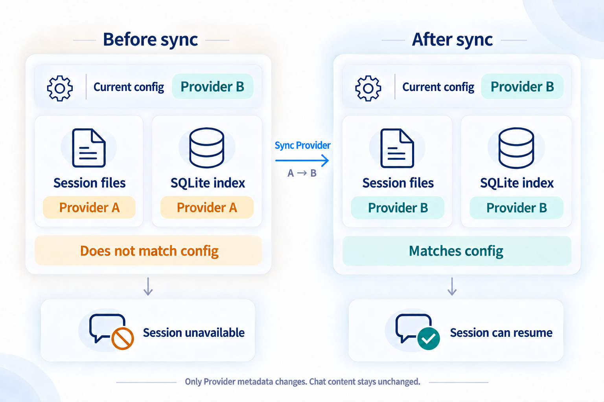
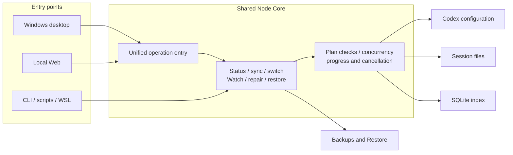

<div align="center">

# codex-provider-sync

### Help reuse existing Codex sessions after switching providers

[](https://github.com/Dailin521/codex-provider-sync/actions/workflows/ci.yml)
[](https://www.npmjs.com/package/@dailin521/codex-provider-sync)
[](https://github.com/Dailin521/codex-provider-sync/releases)
[](../LICENSE)

[中文](../README.md) · **English** · [日本語](README_JA.md) · [한국어](README_KO.md)

</div>

<p align="center">
  
</p>

## What it solves

After a Provider switch, existing sessions may still reference the previous Provider. This tool aligns **Provider metadata in session files and the SQLite chat index** with the current configuration.

**It does not guarantee cross-provider/account continuation or compaction**, handle authentication, or decrypt content. Already aligned sessions do not need another sync.

### When do I need it?

- **You already switched with CCSwitch or another tool:** sync to the Provider in the current configuration.
- **You want to switch in this tool:** choose the target Provider; the tool updates configuration, then synchronizes session files and the index.
- **Provider metadata already matches:** no further sync is needed; check Codex's specific error if a session still fails.

## Core features

- **Sync and switch:** preview or sync immediately; enable Watch when needed.
- **Backups and Restore:** back up before changes, then restore or clean up backups when needed.
- **Chats and logs:** browse sessions by project and inspect results and timings.
- **Storage and repair:** choose data locations and run diagnostics or focused repair when needed.

## Download for Windows

**Windows x64**, no Node.js required. Unsigned; extract the entire portable ZIP.

[Download the latest stable release: installer / portable ZIP, release notes and checksums](https://github.com/Dailin521/codex-provider-sync/releases/latest).

macOS/Linux Electron packages are not yet published. CLI / Web npm versions are released independently.

## Everyday use

1. Open Overview and check the **Provider, storage paths and sync status**.
2. After switching with CCSwitch or another tool, choose **Preview sync**, or **Sync now** to execute immediately.
3. Inspect the result. If partially completed, check the reported reasons before retrying; use **Backups / Restore** to undo changes.

To change the configuration in this app, use **Switch Provider separately** at the bottom of Overview. It **changes configuration and synchronizes historical Provider metadata**, not historical models. Custom Providers must already be defined in `config.toml`.

Actual changes are backed up first. Retention defaults to the **two most recent backups**, managed in Backups / Restore. No-op operations create no backup; recovery-protected backups may exceed the limit.

You can also browse chats by project, right-click to copy session IDs/resume commands, inspect operation logs and configure storage locations. Advanced diagnostics and repair are optional: **ordinary sync never performs them automatically**. Data is not polled in the background; Watch requires explicit activation.

[Full desktop guide](README_DESKTOP_EN.md) · [Migration notes (Chinese)](release-notes/v1.0.0-zh.md)

## Local Web UI

Install Node.js `16.20.2+`, then get the currently published CLI / Web npm version:

```bash
npm install -g @dailin521/codex-provider-sync
codex-provider web
```

By default it listens only on `127.0.0.1:8791` and opens a browser for pairing. See the [Web and SSH guide (Chinese)](README_WEB_UI_ZH.md) for remote access.

## CLI

After installing the same npm package, inspect before syncing:

```bash
codex-provider status
codex-provider sync
```

CLI write commands execute directly. See the [CLI guide (Chinese)](README_CLI_ZH.md) for switching, restore, Watch, paths and JSON exit codes. Check your installed version's `--help` for available commands.

## One core, three entry points

Windows desktop, Local Web and CLI use the same sync, switch, backup and restore logic. The entry point changes how you operate it, not the sync result.



- **Desktop:** everyday double-click use.
- **Local Web:** browser-based, suitable for cross-platform environments.
- **CLI:** scripts, automation and WSL.

Ordinary sync aligns Provider only. Focused repair and Restore require an explicit choice. The old .NET Windows/macOS apps remain compatibility implementations.

## How sync writes, and what affects speed

Sync parses only each session's first metadata line and aligns Provider in the session file and SQLite index; chat content remains unchanged.

- **Eligible for in-place writing, including equal Provider byte lengths:** changes Provider directly without creating a full replacement copy.
- **Other valid first lines:** updates the first line, streams the unchanged body into a new file, then replaces the original.

The tool selects this automatically. There is no speed switch, and Provider names do not need matching lengths.

Speed mainly depends on the number of sessions that need changing. Different Provider lengths and large history files require body copying; backups, pre-write checks, flushing and timestamp restoration also take time. Operation logs show the timing details.

## Frequently asked questions

### I already switched with CCSwitch. What should I do?

Confirm the intended Provider in Overview, then sync. If session files and the index already match, no further sync is needed.

### Does sync change chats or login information?

No. It only aligns Provider metadata in session files and SQLite. It does not modify message bodies, historical models or thread ordering timestamps, or read or modify `auth.json`.

### Why can an old session still fail to continue?

Check the specific Codex error. For encrypted-content or model compatibility problems, return to the original Provider/account or start a new session.

### What does partial completion mean?

Inspect the result or operation log. Problem sessions and their associated index rows remain unchanged while healthy sessions continue. Fix invalid or oversized metadata before preparing again; for locked or changing files, retry after the session stops writing. Completed changes are not automatically rolled back.

### How do I undo a mistaken sync?

Choose the backup from before the operation in Backups / Restore, or run `codex-provider restore <backup-dir>`. See the [desktop guide](README_DESKTOP_EN.md) for details.

For storage paths and WSL, see the [CLI guide (Chinese)](README_CLI_ZH.md). For read/write behavior and performance, see [how it works (Chinese)](WORKING_PRINCIPLE_ZH.md).

## Documentation

- [Documentation index (Chinese)](README_ZH.md) · [Changelog](../CHANGELOG.md) · [Report an issue](https://github.com/Dailin521/codex-provider-sync/issues)
- [How it works (Chinese)](WORKING_PRINCIPLE_ZH.md) · [Current Node Core architecture and I/O invariants](architecture/NODE_CORE_ARCHITECTURE_ZH.md)
- [Contributing and builds](../CONTRIBUTING.md) · [Migration and release gates](migration/VNEXT_MIGRATION_EXECUTION_INDEX_ZH.md) · [AI / Agent guide](../AGENTS.md)

CLI, Web and Electron share Node Core; installing the CLI does not install Electron. The .NET desktop apps remain separate Legacy implementations with build and compatibility maintenance.

## Acknowledgements and license

Thanks to [@tangquanwei](https://github.com/tangquanwei) for the Local Web UI, history browsing and multilingual documentation foundation, brought into v0.5.0 through [PR #80](https://github.com/Dailin521/codex-provider-sync/pull/80), and to everyone contributing code, documentation and issue investigation.

[Contributors](../CONTRIBUTORS.md) · [GitHub Contributors](https://github.com/Dailin521/codex-provider-sync/graphs/contributors) · [LINUX DO community](https://linux.do/) · [MIT License](../LICENSE)
