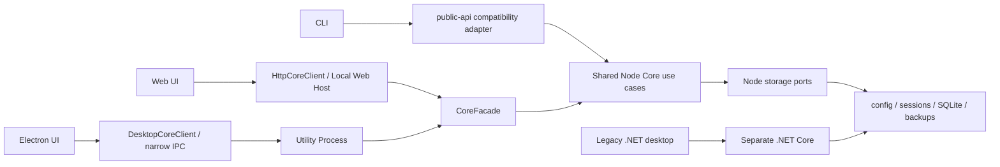

<div align="center">

# codex-provider-sync

### Provider 切り替え後に Codex の既存セッションを再利用するためのツール

[](https://github.com/Dailin521/codex-provider-sync/actions/workflows/ci.yml)
[](https://www.npmjs.com/package/@dailin521/codex-provider-sync)
[](https://github.com/Dailin521/codex-provider-sync/releases)
[](../LICENSE)
[](https://linux.do/)

[中文](../README.md) · [English](README_EN.md) · **日本語** · [한국어](README_KO.md)

</div>

## 解決すること

**セッションが表示されていても、現在の Provider で続行できるとは限りません。** `model_provider` の切り替え後も、セッションファイルと SQLite インデックスに以前の Provider が残る場合があります。本ツールはその情報を現在の設定に揃え、Provider の不一致で利用できない既存セッションの再利用を支援します。履歴一覧の再表示ではなく、切り替え後の再利用が目的です。異なる Provider 間での続行や compact を保証するものではなく、暗号化内容やモデルの互換性は別の問題です。

このツールはセッションファイルと SQLite インデックスの Provider 情報を揃えます。実際の変更前にバックアップを作成し、既定で最新 2 件を保持します。変更がなければバックアップは作成しません。ログイン、アカウント切り替え、復号やメッセージの再構築は行わず、`auth.json` も読み取り・変更しません。

| Provider 情報 | 同期前の例 | 同期後 |
| --- | --- | --- |
| 現在の設定 | Provider B | Provider B（変更なし） |
| セッションファイル | Provider A | Provider B |
| SQLite チャットインデックス | Provider A | Provider B |

### 同期が必要なのはいつですか？

- **通常のケース：**公式 OpenAI とカスタム中継先を切り替える場合。公式 OpenAI は常に `openai` を使用するため Provider ID が変わり、履歴の同期が必要です。
- **既存履歴で ID が混在している場合：**旧セッションに異なる Provider ID が記録されているため、現在の Provider に揃える必要があります。
- **同期が不要なケース：**同じ Provider ID を共有するカスタム中継先だけを切り替える場合、または CCSwitch などがすでに履歴を同期している場合です。

## クイックスタート

> [Windows x64 Electron v1.0.0](https://github.com/Dailin521/codex-provider-sync/releases/tag/v1.0.0) を公開済みです。未署名で、更新は手動インストールです。旧 .NET 更新ボタンでは移行できません。macOS/Linux Electron パッケージは未公開です。CLI / Web の npm バージョンは独立して公開され、デスクトップ版とは一致しません。[ダウンロードと簡潔なガイド（英語）](README_EN.md#download-for-windows)。

| 利用場面 | 推奨する入口 |
| --- | --- |
| Windows デスクトップ | V1 Electron・[ユーザーガイド（英語）](README_DESKTOP_EN.md)・[公開済みファイル](https://github.com/Dailin521/codex-provider-sync/releases) |
| macOS / Linux デスクトップ | [ビルドとプラットフォームガイド（英語）](README_DESKTOP_EN.md)。提供状況は各バージョンの公開済みファイルによります。 |
| ブラウザ UI またはクロスプラットフォーム利用 | [ローカル Web UI（CLI が必要）](#ローカル-web-ui) |
| スクリプト、CI、または WSL | [CLI](#cli) |

### デスクトップ版

提供された V1 の完全なプログラムフォルダー、または [Releases](https://github.com/Dailin521/codex-provider-sync/releases) に実際に掲載された対応パッケージを使用します。Electron の EXE だけをコピーしないでください。

1. Overview で現在の Provider と同期状態を確認します。
2. 外部ツールで切り替えた場合は **Preview sync** で確認するか、**Sync now** で直ちに同期します。
3. 本アプリで変更する場合は **Switch Provider separately** で Provider とルートモデル方針を選び、プレビュー後に確認します。設定変更後に履歴 Provider も同期されます。

チャットはプロジェクトごとに主セッションと折りたたまれた子タスクを表示し、右クリックで ID や再開コマンドをコピーできます。データは初回または明示的な操作後に読み込み、バックグラウンドで定期更新しません。Watch は手動で有効化します。更新確認はその日の初回起動時または手動のみで、自動インストールしません。

バックアップ保持数は Backups / Restore で一元管理し、同じアプリの各操作で共有します。保存先 Home ごとに保持し、Desktop・ブラウザ・CLI 間で設定は共有しません。保存だけでは削除せず、復元に必要な保護対象は上限を超えて残る場合があります。

Windows の新しい操作ログはコピー、フラッシュ、置換、一時ファイル削除、タイムスタンプ復元の時間を表示します。旧ログの値は補いません。旧 .NET の単一 EXE 更新では Electron に直接移行できず、完全な新パッケージが必要です。

[デスクトップ版ガイド（英語）](README_DESKTOP_EN.md)

### ローカル Web UI

ローカル Web UI は CLI に含まれています。Node.js `16.20.2+` をインストールし、本プロジェクトの公式 npm パッケージをインストールして起動します。

```bash
npm install -g @dailin521/codex-provider-sync
codex-provider web
```

よく使うオプション:

```bash
codex-provider web --no-open       # ブラウザを自動で開かない
codex-provider web --port 8792     # ポートを指定する
codex-provider web --reset-access  # ブラウザを再ペアリングする
```

Web UI はデフォルトで `127.0.0.1` のみで待ち受け、ブラウザを自動で開いてペアリングします。保存先はサーバー管理の Profile で指定します。Sync now はクリックで実行を許可し、内部で Prepare/Apply を続けて行います。Preview sync、Switch、Repair、Restore はプレビュー確認後に実行します。Web にはデスクトップ操作ログやアプリ更新はありません。

#### Provider 切り替え後に履歴を同期する

1. CCSwitch など普段使用しているツールで Provider を切り替えます。
2. Overview で現在の Provider と同期状態を確認します。
3. Preview sync で確認後に実行するか、Sync now をクリックします。
4. 結果が partial の場合は、使用中のセッションを終了して再試行します。スキップされた記録を更新済みとして扱わないでください。

> **注意：** メタデータ同期は Provider の不一致を解消するもので、利用できない原因をすべて修復するものではありません。Provider をまたいで旧セッションを続行すると、切り替え先のバックエンドが `encrypted_content` の推論内容を復号できず、続行や compact に失敗する場合があります。

[Web UI の詳細（中国語）](README_WEB_UI_ZH.md)

### CLI

CLI は Node.js `16.20.2+` をサポートします。Node.js のインストール後、本プロジェクトの公式 npm パッケージをインストールします。

```bash
npm install -g @dailin521/codex-provider-sync
codex-provider status
codex-provider sync
```

| コマンド | 用途 |
| --- | --- |
| `codex-provider status` | Provider、rollout、SQLite の状態を確認する |
| `codex-provider sync` | 現在の Provider に同期する |
| `codex-provider switch <provider-id>` | Provider を切り替えてから同期する |
| `codex-provider diagnostics` | 明示的な読み取り専用の完全診断 |
| `codex-provider repair <targets>` | 選択したメタデータだけを修復する |
| `codex-provider prune-backups --keep N` | 古い管理対象バックアップを削除する |
| `codex-provider restore <backup-dir>` | バックアップを復元する |
| `codex-provider watch` | 設定と SQLite の変更を監視する |

`switch` は対象 Provider に `model` があればルートモデルへ反映し、なければ現在値を保持します。`--keep-root-model` は現在値を保持、`--model <name>` は明示的に指定します。どの方法も履歴モデルを変更しません。

`sync` は config のルート `model_provider` を使用し、未指定時は `openai` です。カスタム Provider は事前定義が必要です。同期時のスキャンでは先頭行だけを解析します。安全な ID の JSON リテラルが UTF-8 バイト長で等しく一意に特定できれば、その位置を直接更新します。それ以外の有効な先頭行は一時ファイルへストリームコピーして置換し、本文のバイト列を保ちます。失敗したインプレース更新を強制的な全ファイル置換へ切り替えません。タイムスタンプ復元も維持します。固定長の名前に揃える必要はなく、`--fast` や `sync --provider` はありません。

モデル、cwd、userEvent、workspaceRoots の変更は明示的な Repair に分離されています。workspaceRoots は cwd を含みます。Diagnostics は手動の読み取り専用検査で、失敗した Sync から自動実行しません。暗号化内容の変更、記録番号の変更、履歴表示インデックスの再構築は提供しません。

CLI の書き込みコマンドは対話確認なしで実行します。プレビューが必要なら Desktop/Web を使ってください。有限コマンドの `--json` は stdout に単一結果、stderr に進捗を出し、partial は終了コード 3 です。Watch/Web はこの JSON モードに非対応です。[CLI ガイド（中国語）](README_CLI_ZH.md)

SQLite Home の解決順序: `--sqlite-home` → `config.toml` ルートの `sqlite_home` → `CODEX_SQLITE_HOME` → `<Codex Home>/sqlite`。デフォルトレイアウトだけが `<Codex Home>/state_5.sqlite` にフォールバックします。

## 現在のアーキテクチャ



- Web UI は `HttpCoreClient → /api/core → CoreFacade`、CLI は `src/public-api.js` 互換アダプターを通して同じ Node Core ユースケースを呼び出します。
- `V1` の Electron 主デスクトップは `DesktopCoreClient → 制限された Preload/Main IPC → Utility Process → Node Core` を使用し、Renderer から Node、任意パス、汎用 IPC にはアクセスできません。
- Windows GUI は Application 層を通じて .NET Core を呼び出し、macOS GUI は現在 .NET Core を直接呼び出します。
- .NET は独立した Legacy 実装です。旧版のモデル修復、journal、自動全体ロールバックを新しい Node Core の動作として扱わないでください。

V1 は Electron を主デスクトップアプリとして提供します。.NET Windows/macOS 実装は引き続きビルド・テストされる互換版として保持します。

## 安全上の境界

- Sync/Switch/Repair の実際の変更前に `<Codex Home>/backups_state/provider-sync/<timestamp>` へバックアップし、既定で最新 2 件を保持します。no-op では作成しません。
- 通常の書き込みは Home ロックと SQLite トランザクションを使い、ファイル間の journal や自動全体ロールバックを行いません。変更後の失敗は partial として、新しいプレビューで確認して再試行するか、CLI コマンドを再実行します。取り消したい場合は手動で Restore します。Restore だけが独立したスナップショット、journal、補償処理を保持します。
- メッセージ本文、セッションタイトル、認証情報、`auth.json`、`updated_at` は変更しません。
- SQLite が使用中の場合は、Codex、Codex App、app-server を閉じてから再試行してください。
- アクティブなセッションが rollout をロックしている場合、他のファイルは続行します。セッション終了後にもう一度同期してください。
- Provider またはアカウントをまたいで旧セッションを続行すると、切り替え先のバックエンドが `encrypted_content` を復号できず、続行や compact に失敗する場合があります。その場合は元の Provider／アカウントに戻すか、新しいセッションを開始してください。
- Windows から WSL UNC SQLite Home に直接書き込むことはできません。WSL に入り、Linux パスで CLI を実行してください。

## ドキュメント

- [AI / Agent ガイド](../AGENTS.md)
- [Legacy .NET Windows GUI（中国語）](README_GUI_ZH.md)
- [現在の Core アーキテクチャ（中国語）](architecture/NODE_CORE_ARCHITECTURE_ZH.md)
- [V1 Electron デスクトップ版ガイド（英語）](README_DESKTOP_EN.md)
- [Web UI（中国語）](README_WEB_UI_ZH.md)
- [中文](../README.md) · [English](README_EN.md) · 日本語 · [한국어](README_KO.md)
- [macOS GUI: 中文](README_MAC_GUI_ZH.md) · [English](README_MAC_GUI_EN.md)
- [仕組み（中国語）](WORKING_PRINCIPLE_ZH.md) · [変更履歴](../CHANGELOG.md) · [コントリビューションガイド](../CONTRIBUTING.md)

## 開発

ワークスペース、Web、Electron の構築は Node 24 を使用します。インストール済みのルート CLI は Node 16.20.2 以降に対応します。現在の Core ガイドを先に読み、Provider I/O の不変条件を維持してください。

```bash
npm ci
npm run architecture:check
npm run web:build
npm run web:start
npm test
dotnet test desktop/CodexProviderSync.Core.Tests/CodexProviderSync.Core.Tests.csproj
```

メンテナーは、Windows GUI の Release とは独立して CLI/Web パッケージを公開できます。[npm 公開ガイド（中国語）](NPM_PUBLISHING.md)を参照してください。

## 謝辞

ローカル Web UI を提案・実装し、履歴閲覧機能と多言語ドキュメントの基盤を提供するとともに、[PR #80](https://github.com/Dailin521/codex-provider-sync/pull/80) を通じて v0.5.0 に導入した [@tangquanwei](https://github.com/tangquanwei)、そしてコード、ドキュメント、テスト、問題調査に貢献したすべての方に感謝します。

[コントリビューター一覧](../CONTRIBUTORS.md) · [GitHub Contributors](https://github.com/Dailin521/codex-provider-sync/graphs/contributors)

## License

MIT
