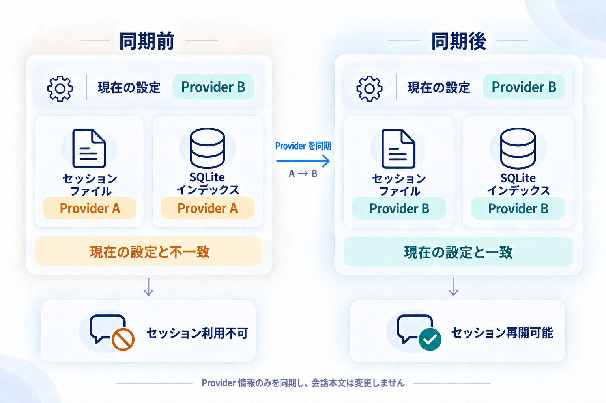
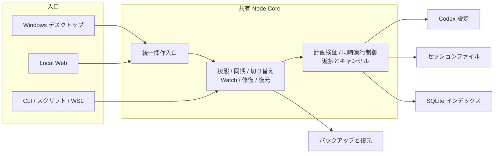

<div align="center">

# codex-provider-sync

### Provider 切り替え後に Codex の既存セッションを再利用するためのツール

[](https://github.com/Dailin521/codex-provider-sync/actions/workflows/ci.yml)
[](https://www.npmjs.com/package/@dailin521/codex-provider-sync)
[](https://github.com/Dailin521/codex-provider-sync/releases)
[](../LICENSE)
[](https://linux.do/)

[中文](../README.md) · [English](README_EN.md) · **日本語** · [한국어](README_KO.md)

</div>

<p align="center">
  
</p>

## 解決すること

Provider を切り替えた後も、既存セッションには以前の Provider が記録されていることがあります。本ツールは**セッションファイルと SQLite チャットインデックスの Provider 情報**を現在の設定に揃え、メタデータの不一致を解消します。

**Provider やアカウントをまたいだ継続・compact を保証するものではなく**、ログイン、認証、暗号化内容は扱いません。すでに情報が揃っている場合、再同期は不要です。

### いつ使いますか？

- **CCSwitch などで切り替え済み:** 現在の設定にある Provider へ同期します。
- **このツールで切り替える:** 対象 Provider を選ぶと、設定を更新してからセッションファイルとインデックスを同期します。
- **Provider 情報がすでに一致している:** 再同期は不要です。継続できない場合は Codex の具体的なエラーを確認します。

## 主な機能

- **同期と切り替え:** プレビューまたは即時同期。必要に応じて Watch を有効化します。
- **バックアップと復元:** 変更前にバックアップし、復元または整理できます。
- **チャットとログ:** プロジェクトごとにセッションを確認し、結果と所要時間を見られます。
- **保存先と修復:** 保存先を指定し、必要なときだけ診断や個別修復を実行します。

## Windows デスクトップ版をダウンロード

**Windows x64**、Node.js は不要です。未署名のため、ポータブル版は ZIP 全体を展開してください。

[最新版をダウンロード：インストーラー / ポータブル ZIP、リリースノートとチェックサム](https://github.com/Dailin521/codex-provider-sync/releases/latest)

macOS/Linux 向け Electron パッケージは未公開です。CLI / Web の npm 版は別途公開されます。

## 日常的な使い方

1. Overview を開き、**Provider、保存先、同期状態**を確認します。
2. CCSwitch などで Provider を切り替えた場合は、**Preview sync** で影響を確認するか、**Sync now** ですぐ実行します。
3. 結果を確認します。partial の場合は占用中のセッションを終了して再試行し、取り消す場合は **Backups / Restore** を開きます。

**Switch Provider separately** は設定を変更して履歴 Provider を同期しますが、履歴モデルは変更しません。カスタム Provider は事前に設定しておく必要があります。

変更前に自動バックアップし、既定では最新 **2 件**を保持します。変更が不要な場合はバックアップを作成しません。

[デスクトップ完全ガイド（英語）](README_DESKTOP_EN.md) · [旧版移行説明（中国語）](release-notes/v1.0.0-zh.md)

## ローカル Web UI

Node.js `16.20.2+` をインストールしてから、公開済みの CLI / Web npm パッケージを実行します。

```bash
npm install -g @dailin521/codex-provider-sync
codex-provider web
```

既定では `127.0.0.1:8791` のみで待ち受け、ブラウザーでペアリングします。別デバイスからの利用は [Web と SSH のガイド（中国語）](README_WEB_UI_ZH.md)を参照してください。

## CLI

```bash
codex-provider status
codex-provider sync
```

CLI の書き込みコマンドは直接実行されます。切り替え、復元、Watch、パス、JSON 終了コードは [CLI ガイド（中国語）](README_CLI_ZH.md)を参照し、利用可能なコマンドはインストール済みバージョンの `--help` を確認してください。

## 1 つのコア、3 つの入口

Windows デスクトップ版、Local Web、CLI は、同じ同期・切り替え・バックアップ・復元ロジックを使用します。入口は操作方法だけを変え、同期結果は変えません。



- **デスクトップ版:** 日常的なダブルクリック利用。
- **Local Web:** ブラウザーで操作するクロスプラットフォーム環境向け。
- **CLI:** スクリプト、自動化、WSL 向け。

通常の同期は Provider だけを揃えます。個別修復と復元は明示的に選択します。旧 .NET Windows/macOS 版は互換実装として維持されています。

## 同期の書き込みと速度

同期は各セッションの先頭メタデータ行だけを解析し、セッションファイルと SQLite の Provider を揃えます。会話本文は変更しません。

- **Provider のバイト長が同じ場合を含む、原位置書き込みの条件を満たす場合:** Provider を直接更新し、置換用の完全コピーを作成しません。
- **その他の有効な先頭行:** 先頭行を更新し、本文をストリーミングで新しいファイルへコピーしてから置き換えます。

この方式は自動選択されます。高速化オプションは不要で、Provider 名の長さを揃える必要もありません。

速度は主に更新対象のセッション数で決まります。Provider の長さが異なり履歴ファイルが大きい場合は本文コピーが必要です。バックアップ、書き込み前検証、保存、タイムスタンプ復元にも時間がかかります。操作ログで各段階の時間を確認できます。

## よくある質問

### CCSwitch で切り替え済みですが、何をすればよいですか？

このツールを開き、現在の Provider が目的のものか確認して同期します。セッションファイルとインデックスの Provider がすでに一致していれば不要です。

### 同期で会話内容やログイン情報は変わりますか？

変わりません。会話ファイルと SQLite インデックスの Provider だけを揃えます。会話本文、履歴モデル、セッション順序の時間、`auth.json` は読み取りも変更もしません。

### 同期後も古いセッションを続けられないのはなぜですか？

Provider 一致は継続条件の一つです。Codex の具体的なエラーを確認してください。暗号化内容やモデル互換性の問題なら、元の Provider / アカウントへ戻るか、新しいセッションを作成します。

### 「部分完了」と表示された場合は？

結果または操作ログの理由を確認します。異常なセッションは関連インデックスを保持したままスキップし、正常なセッションは続行します。形式やサイズの問題はデータを直してから再プレビューし、占用または変更されたファイルは書き込み停止後に再同期します。完了済みの変更は自動で全体ロールバックされません。

### 間違えて同期した場合、どう戻せますか？

**Backups / Restore** で操作前のバックアップを選んで復元します。CLI では `codex-provider restore <backup-dir>` を使えます。

パス設定と WSL は [CLI ガイド（中国語）](README_CLI_ZH.md)、同期の読書きと速度は[仕組み（中国語）](WORKING_PRINCIPLE_ZH.md)を参照してください。

## ドキュメントと開発

- [文書索引（中国語）](README_ZH.md) · [変更履歴](../CHANGELOG.md) · [Issue を報告](https://github.com/Dailin521/codex-provider-sync/issues)
- [仕組み（中国語）](WORKING_PRINCIPLE_ZH.md) · [現在の Node Core アーキテクチャ（中国語）](architecture/NODE_CORE_ARCHITECTURE_ZH.md)
- [コントリビューションとビルド](../CONTRIBUTING.md) · [移行とリリースゲート](migration/VNEXT_MIGRATION_EXECUTION_INDEX_ZH.md) · [AI / Agent ガイド](../AGENTS.md)

```bash
npm ci
npm run architecture:check
npm test
npm run web:build
npm run desktop:build
```

## 謝辞とライセンス

ローカル Web UI、履歴閲覧、多言語ドキュメントの基盤を提供し、[PR #80](https://github.com/Dailin521/codex-provider-sync/pull/80)を通じて v0.5.0 に導入した [@tangquanwei](https://github.com/tangquanwei)、およびコード、文書、テスト、問題調査に貢献した皆さんに感謝します。

[コントリビューター](../CONTRIBUTORS.md) · [GitHub Contributors](https://github.com/Dailin521/codex-provider-sync/graphs/contributors) · [LINUX DO](https://linux.do/) · [MIT License](../LICENSE)
