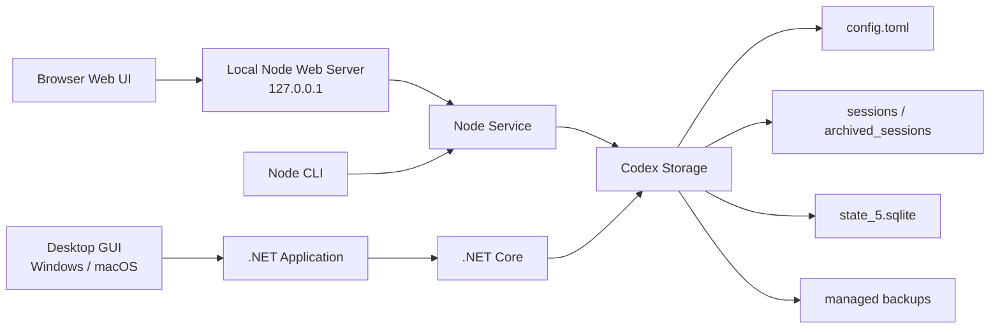

<div align="center">

# codex-provider-sync

### Provider 切り替え後も Codex の過去セッションを再表示する

[](https://github.com/Dailin521/codex-provider-sync/actions/workflows/ci.yml)
[](https://github.com/Dailin521/codex-provider-sync/releases/latest)
[](../LICENSE)
[](https://linux.do/)

[Windows GUI をダウンロード](https://github.com/Dailin521/codex-provider-sync/releases/latest) · [中文](../README.md) · [English](README_EN.md) · 日本語 · [한국어](README_KO.md)

</div>

## 解決すること

`model_provider` を切り替えた後、既存セッションが Codex Desktop や `/resume` から消えることがあります。データ自体は通常ディスク上に残っていますが、セッションファイルと SQLite インデックス内の Provider 情報が同期されていません。

このツールはセッションファイルと SQLite インデックスを同期してセッションの可視性を復元し、書き込み前にバックアップを作成します。ログイン、アカウント切り替え、`auth.json`、メッセージ本文は扱いません。

## クイックスタート

| 利用場面 | 推奨する入口 |
| --- | --- |
| Windows デスクトップ | [ネイティブ Windows GUI](#windows-gui) |
| macOS デスクトップ | [ローカル Web UI](#ローカル-web-ui)・[ネイティブ GUI のビルド手順](README_MAC_GUI_EN.md) |
| ブラウザ UI またはクロスプラットフォーム利用 | [ローカル Web UI](#ローカル-web-ui) |
| スクリプト、CI、または WSL | [CLI](#cli) |

### Windows GUI

[Releases](https://github.com/Dailin521/codex-provider-sync/releases/latest) から `CodexProviderSync.exe` をダウンロードします。

1. 「Refresh」をクリックします。
2. 対象の Provider を選択します。
3. 「Sync Now」をクリックします。

コード署名は付与していないため、Windows でセキュリティ警告が表示される場合があります。本プロジェクトの Releases からのみダウンロードしてください。

[Windows GUI の詳細](README_GUI_ZH.md)

### ローカル Web UI

CLI のインストール後に実行します。

```bash
codex-provider web
```


よく使うオプション:

```bash
codex-provider web --no-open       # ブラウザを自動で開かない
codex-provider web --port 8792     # ポートを指定する
codex-provider web --reset-access  # ブラウザを再ペアリングする
```

Web UI はデフォルトで `127.0.0.1` のみで待ち受け、ブラウザを自動で開いてペアリングします。保存先は Profile で管理し、書き込み操作には確認が必要です。Profile が変更された場合は再確認が必要です。

[Web UI の詳細](README_WEB_UI_ZH.md)

### CLI

CLI は Node.js `16.20.2+` をサポートします。未インストールの場合は次を実行します。

```bash
npm install -g git+https://github.com/Dailin521/codex-provider-sync.git
codex-provider status
codex-provider sync
```

| コマンド | 用途 |
| --- | --- |
| `codex-provider status` | Provider、rollout、SQLite の状態を確認する |
| `codex-provider sync` | 現在の Provider に同期する |
| `codex-provider switch <provider-id>` | Provider を切り替えてから同期する |
| `codex-provider restore <backup-dir>` | バックアップを復元する |
| `codex-provider watch` | 設定と SQLite の変更を監視する |

SQLite Home の解決順序: `--sqlite-home` → `config.toml` ルートの `sqlite_home` → `CODEX_SQLITE_HOME` → `<Codex Home>/sqlite`。デフォルトレイアウトだけが `<Codex Home>/state_5.sqlite` にフォールバックします。

## 現在のアーキテクチャ



- Web UI と CLI は同じ Node サービスロジックを使用します。
- Windows/macOS の GUI は Application 層を通じて .NET Core を呼び出します。
- 両方の経路で同じ設定、rollout、SQLite、バックアップの安全境界を扱います。

## 安全上の境界

- `sync` / `switch` の前に、毎回 `~/.codex/backups_state/provider-sync/<timestamp>` へバックアップします。
- メッセージ本文、セッションタイトル、認証情報、`auth.json`、`updated_at` は変更しません。
- SQLite が使用中の場合は、Codex、Codex App、app-server を閉じてから再試行してください。
- アクティブなセッションが rollout をロックしている場合、他のファイルは続行します。セッション終了後にもう一度同期してください。
- Provider またはアカウントをまたぐ `encrypted_content` は、一覧の可視性しか復元できない場合があります。
- Windows から WSL UNC SQLite Home に直接書き込むことはできません。WSL に入り、Linux パスで CLI を実行してください。

## ドキュメント

- [AI / Agent ガイド](../AGENTS.md)

- [Windows GUI](README_GUI_ZH.md)
- [Web UI](README_WEB_UI_ZH.md)
- [中文](../README.md) · [English](README_EN.md) · 日本語 · [한국어](README_KO.md)
- [macOS GUI: 中文](README_MAC_GUI_ZH.md) · [English](README_MAC_GUI_EN.md)
- [仕組み](WORKING_PRINCIPLE_ZH.md) · [変更履歴](../CHANGELOG.md) · [コントリビューションガイド](../CONTRIBUTING.md)

## 開発

```bash
npm ci
npm run web:build
npm run web:start
npm test
dotnet test desktop/CodexProviderSync.Core.Tests/CodexProviderSync.Core.Tests.csproj
```

## License

MIT
