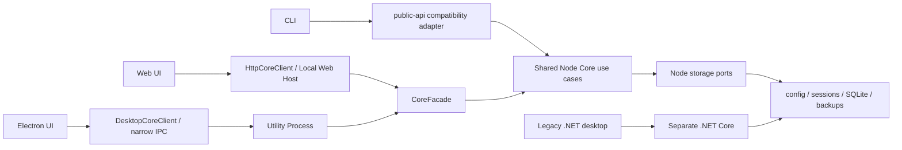

<div align="center">

# codex-provider-sync

### Provider 전환 후 기존 Codex 세션을 다시 사용할 수 있도록 돕습니다

[](https://github.com/Dailin521/codex-provider-sync/actions/workflows/ci.yml)
[](https://www.npmjs.com/package/@dailin521/codex-provider-sync)
[](https://github.com/Dailin521/codex-provider-sync/releases)
[](../LICENSE)
[](https://linux.do/)

[中文](../README.md) · [English](README_EN.md) · [日本語](README_JA.md) · **한국어**

</div>

## 해결하는 문제

**세션이 보여도 현재 Provider로 계속 사용할 수 있다는 뜻은 아닙니다.** `model_provider`를 전환한 뒤에도 세션 파일과 SQLite 인덱스에 이전 Provider가 남아 있을 수 있습니다. 이 도구는 해당 정보를 현재 설정에 맞춰 Provider 불일치로 사용할 수 없는 기존 세션의 재사용을 돕습니다. 기록 목록을 다시 표시하는 것이 아니라 전환 후 세션을 다시 사용하는 데 초점을 둡니다. 서로 다른 Provider 간의 대화 계속이나 compact를 보장하지 않으며 암호화된 내용과 모델 호환성은 별도 문제입니다.

이 도구는 세션 파일과 SQLite 인덱스의 Provider 정보를 맞춥니다. 실제 변경 전에 백업을 만들고 기본적으로 최신 2개를 유지하며, 변경이 없으면 백업을 만들지 않습니다. 로그인, 계정 전환, 복호화나 메시지 재구성을 하지 않으며 `auth.json`을 읽거나 수정하지 않습니다.

| Provider 정보 | 동기화 전 예시 | 동기화 후 |
| --- | --- | --- |
| 현재 설정 | Provider B | Provider B (변경 없음) |
| 세션 파일 | Provider A | Provider B |
| SQLite 채팅 인덱스 | Provider A | Provider B |

### 언제 동기화가 필요한가요?

- **일반적인 경우:** 공식 OpenAI와 사용자 지정 릴레이 사이에서 전환합니다. 공식 OpenAI는 항상 `openai`를 사용하므로 Provider ID가 바뀌며 기록을 동기화해야 합니다.
- **기존 기록에 ID가 섞인 경우:** 이전 세션에 서로 다른 Provider ID가 기록되어 있으므로 현재 Provider에 맞춰야 합니다.
- **동기화가 필요 없는 경우:** 같은 Provider ID를 공유하는 사용자 지정 릴레이 사이에서만 전환하거나 CCSwitch 같은 도구가 이미 기록을 동기화한 경우입니다.

## 빠른 시작

> 이 가이드는 V1 코드를 설명합니다. Electron이 기본 데스크톱 앱이며 .NET은 Legacy 호환 버전으로 유지됩니다. 로컬 V1 빌드가 공개 릴리스, 서명 또는 업데이트 채널 활성화를 의미하지는 않습니다. Releases에 실제로 올라온 파일만 사용하세요. npm은 공개된 버전을 설치합니다. [제공 현황](migration/VNEXT_MIGRATION_EXECUTION_INDEX_ZH.md)도 확인하세요.

| 상황 | 권장 방법 |
| --- | --- |
| Windows 데스크톱 | V1 Electron / [사용자 가이드(영문)](README_DESKTOP_EN.md) / [공개된 파일](https://github.com/Dailin521/codex-provider-sync/releases) |
| macOS / Linux 데스크톱 | [빌드 및 플랫폼 가이드(영문)](README_DESKTOP_EN.md). 지원 여부는 해당 버전에서 실제 공개한 파일에 따릅니다. |
| 브라우저 UI 또는 크로스 플랫폼 사용 | [로컬 Web UI (CLI 필요)](#로컬-web-ui) |
| 스크립트, CI 또는 WSL | [CLI](#cli) |

### 데스크톱 앱

제공된 V1 전체 프로그램 폴더 또는 [Releases](https://github.com/Dailin521/codex-provider-sync/releases)에 실제로 올라온 해당 플랫폼 패키지를 사용하세요. Electron EXE만 따로 복사하지 마세요.

1. Overview에서 현재 Provider와 동기화 상태를 확인합니다.
2. 외부 도구로 전환했다면 **Preview sync**으로 먼저 확인하거나 **Sync now**로 바로 동기화합니다.
3. 앱에서 전환하려면 **Switch Provider separately**에서 Provider와 루트 모델 방식을 선택하고 미리보기 후 확인합니다. 설정 변경 후 기록의 Provider도 동기화합니다.

채팅은 프로젝트별로 주 세션과 접힌 하위 작업을 표시하며, 우클릭으로 세션 ID나 재개 명령을 복사할 수 있습니다. 데이터는 최초 로드 또는 명시적 작업에 따라 갱신하며 백그라운드 폴링을 하지 않습니다. Watch는 직접 활성화해야 합니다. 업데이트는 매일 첫 실행 시 한 번 또는 수동으로 확인하며 자동 설치하지 않습니다.

백업 수는 Backups / Restore에서 통합 관리합니다. 같은 앱의 작업들이 설정을 공유하지만 Home별로 따로 보관하며 Desktop·브라우저·CLI 간 설정은 공유하지 않습니다. 설정 저장만으로 삭제하지 않고, 복원에 필요한 보호된 백업은 한도를 넘을 수 있습니다.

새 Windows 작업 로그에는 복사, 디스크 플러시, 교체, 임시 파일 정리, 타임스탬프 복원 시간이 표시됩니다. 이전 로그의 값은 추정하지 않습니다. 기존 .NET 단일 EXE 업데이트로 Electron에 바로 이전할 수 없으며 전체 새 패키지가 필요합니다.

[데스크톱 앱 가이드(영문)](README_DESKTOP_EN.md)

### 로컬 Web UI

로컬 Web UI는 CLI에 포함되어 있습니다. Node.js `16.20.2+`를 설치한 다음 이 프로젝트의 공식 npm 패키지를 설치하고 실행하세요.

```bash
npm install -g @dailin521/codex-provider-sync
codex-provider web
```

자주 쓰는 옵션:

```bash
codex-provider web --no-open       # 브라우저를 자동으로 열지 않음
codex-provider web --port 8792     # 포트 지정
codex-provider web --reset-access  # 브라우저 재페어링
```

Web UI는 기본적으로 `127.0.0.1`에서만 수신하며, 브라우저를 자동으로 열어 페어링을 진행합니다. 저장 경로는 서버 관리 Profile에서 지정합니다. Sync now는 클릭 자체로 실행이 승인되며, 내부에서 Prepare/Apply를 연속 수행합니다. Preview sync, Switch, Repair, Restore는 미리보기 후 확인이 필요합니다. Web에는 데스크톱 작업 로그와 앱 업데이트가 없습니다.

#### Provider 전환 후 기록 동기화

1. CCSwitch 등 평소 사용하는 도구로 Provider를 전환합니다.
2. Overview에서 현재 Provider와 동기화 상태를 확인합니다.
3. Preview sync으로 확인 후 실행하거나 Sync now를 클릭합니다.
4. partial 결과라면 사용 중인 세션을 종료하고 다시 동기화합니다. 건너뛴 기록을 업데이트 완료로 간주하지 마세요.

> **주의:** 메타데이터 동기화는 Provider 불일치를 해결하며 세션을 사용할 수 없는 모든 원인을 복구하지는 않습니다. Provider를 바꾼 뒤 이전 세션을 계속하면 대상 백엔드가 `encrypted_content`의 추론 내용을 복호화하지 못해 대화 계속 또는 compact가 실패할 수 있습니다.

[Web UI 전체 안내 (중국어)](README_WEB_UI_ZH.md)

### CLI

CLI는 Node.js `16.20.2+`를 지원합니다. Node.js를 설치한 후 이 프로젝트의 공식 npm 패키지를 설치합니다.

```bash
npm install -g @dailin521/codex-provider-sync
codex-provider status
codex-provider sync
```

| 명령 | 용도 |
| --- | --- |
| `codex-provider status` | Provider, rollout, SQLite 상태 확인 |
| `codex-provider sync` | 현재 Provider로 동기화 |
| `codex-provider switch <provider-id>` | Provider 전환 후 동기화 |
| `codex-provider diagnostics` | 명시적인 전체 읽기 전용 검사 |
| `codex-provider repair <targets>` | 선택한 메타데이터만 수정 |
| `codex-provider prune-backups --keep N` | 오래된 관리형 백업 정리 |
| `codex-provider restore <backup-dir>` | 백업 복원 |
| `codex-provider watch` | 설정과 SQLite 변경 감시 |

`switch`는 대상 Provider에 `model`이 있으면 루트 모델에 반영하고, 없으면 현재 값을 유지합니다. `--keep-root-model`은 현재 값 유지, `--model <name>`은 명시적 지정입니다. 어느 방식도 기록의 모델을 변경하지 않습니다.

`sync`는 config의 루트 `model_provider`를 사용하며 없으면 `openai`를 사용합니다. 사용자 지정 Provider는 미리 정의되어 있어야 합니다. 동기화 스캔은 첫 줄만 파싱합니다. 안전한 ID의 JSON 리터럴이 UTF-8 바이트 길이가 같고 유일하게 식별되면 해당 위치만 갱신합니다. 그 외의 유효한 첫 줄은 임시 파일에 스트림 복사 후 교체하며 본문 바이트는 유지합니다. 제자리 쓰기 실패를 강제 전체 파일 교체로 우회하지 않습니다. 타임스탬프 복원도 유지합니다. 고정 길이 이름으로 맞출 필요가 없고 `--fast`나 `sync --provider`는 없습니다.

모델, cwd, userEvent, workspaceRoots 변경은 명시적인 Repair로 분리됩니다. workspaceRoots는 cwd를 포함합니다. Diagnostics는 수동 읽기 전용 검사이며 Sync 실패 후 자동 실행되지 않습니다. 암호화 내용 변경, 기록 번호 변경, 기록 표시 인덱스 재구축은 제공하지 않습니다.

CLI 쓰기 명령은 대화형 확인 없이 실행됩니다. 미리보기가 필요하면 Desktop/Web을 사용하세요. 장기 실행이 아닌 명령의 `--json`은 stdout에 단일 결과, stderr에 진행 정보를 내보내며 partial은 종료 코드 3입니다. Watch/Web은 이 JSON 모드를 지원하지 않습니다. [CLI 가이드(중국어)](README_CLI_ZH.md)

SQLite Home 해석 순서: `--sqlite-home` → `config.toml` 루트의 `sqlite_home` → `CODEX_SQLITE_HOME` → `<Codex Home>/sqlite`. 기본 레이아웃에서만 `<Codex Home>/state_5.sqlite`로 대체합니다.

## 현재 아키텍처



- Web UI는 `HttpCoreClient → /api/core → CoreFacade`를 사용하고, CLI는 `src/public-api.js` 호환 어댑터를 통해 같은 Node Core 유스케이스를 호출합니다.
- `V1` Electron 주 데스크톱은 `DesktopCoreClient → 제한된 Preload/Main IPC → Utility Process → Node Core` 경로를 사용하며 Renderer에서는 Node, 임의 경로 또는 범용 IPC에 접근할 수 없습니다.
- Windows GUI는 Application 계층을 통해 .NET Core를 호출하고, macOS GUI는 현재 .NET Core를 직접 호출합니다.
- .NET은 별도의 Legacy 구현입니다. 이전 버전의 모델 수정, journal, 자동 전체 롤백을 새 Node Core의 동작으로 간주하지 마세요.

V1은 Electron을 기본 데스크톱 앱으로 제공합니다. .NET Windows/macOS 구현은 계속 빌드하고 테스트하는 호환 버전으로 유지됩니다.

## 안전 범위

- Sync/Switch/Repair의 실제 변경 전에 `<Codex Home>/backups_state/provider-sync/<timestamp>`에 백업하고 기본적으로 최신 2개를 유지합니다. no-op에서는 만들지 않습니다.
- 일반 쓰기는 Home 잠금과 SQLite 트랜잭션을 사용하며 파일 간 journal이나 자동 전체 롤백을 하지 않습니다. 변경 후 실패는 partial로 보고합니다. 새 미리보기로 확인 후 다시 시도하거나 CLI 명령을 다시 실행하세요. 변경을 되돌리려면 수동 Restore를 사용합니다. Restore만 별도 스냅샷, journal, 보상 처리를 유지합니다.
- 메시지 본문, 세션 제목, 인증 정보, `auth.json`, `updated_at`은 수정하지 않습니다.
- SQLite가 사용 중이면 Codex, Codex App, app-server를 닫은 뒤 다시 시도하세요.
- 활성 세션이 rollout을 잠그면 나머지 파일은 계속 처리합니다. 세션 종료 후 다시 동기화하면 됩니다.
- Provider 또는 계정을 바꾼 뒤 이전 세션을 계속하면 대상 백엔드가 `encrypted_content`를 복호화하지 못해 대화 계속 또는 compact가 실패할 수 있습니다. 이 경우 원래 Provider/계정으로 돌아가거나 새 세션을 시작하세요.
- Windows에서는 WSL UNC SQLite Home에 직접 쓸 수 없습니다. WSL에서 Linux 경로로 CLI를 실행하세요.

## 문서

- [AI / Agent 가이드](../AGENTS.md)
- [Legacy .NET Windows GUI (중국어)](README_GUI_ZH.md)
- [현재 Core 아키텍처(중국어)](architecture/NODE_CORE_ARCHITECTURE_ZH.md)
- [V1 Electron 데스크톱 앱 가이드(영어)](README_DESKTOP_EN.md)
- [Web UI (중국어)](README_WEB_UI_ZH.md)
- [中文](../README.md) · [English](README_EN.md) · [日本語](README_JA.md)
- [macOS GUI: 中文](README_MAC_GUI_ZH.md) · [English](README_MAC_GUI_EN.md)
- [작동 원리 (중국어)](WORKING_PRINCIPLE_ZH.md) · [변경 이력](../CHANGELOG.md) · [기여 안내](../CONTRIBUTING.md)

## 개발

워크스페이스, Web, Electron 빌드는 Node 24를 사용합니다. 설치된 루트 CLI는 Node 16.20.2 이상을 지원합니다. 현재 Core 가이드를 먼저 읽고 Provider I/O 불변 조건을 유지하세요.

```bash
npm ci
npm run architecture:check
npm run web:build
npm run web:start
npm test
dotnet test desktop/CodexProviderSync.Core.Tests/CodexProviderSync.Core.Tests.csproj
```

유지관리자는 Windows GUI Release와 별도로 CLI/Web 패키지를 게시할 수 있습니다. [npm 게시 안내(중국어)](NPM_PUBLISHING.md)를 참조하세요.

## 감사의 말

로컬 Web UI를 제안하고 구현했으며, 채팅 기록 탐색과 다국어 문서의 기반을 기여하고 [PR #80](https://github.com/Dailin521/codex-provider-sync/pull/80)을 통해 v0.5.0에 도입한 [@tangquanwei](https://github.com/tangquanwei), 그리고 코드, 문서, 테스트와 문제 조사에 기여한 모든 분께 감사드립니다.

[기여자 목록](../CONTRIBUTORS.md) · [GitHub Contributors](https://github.com/Dailin521/codex-provider-sync/graphs/contributors)

## License

MIT
