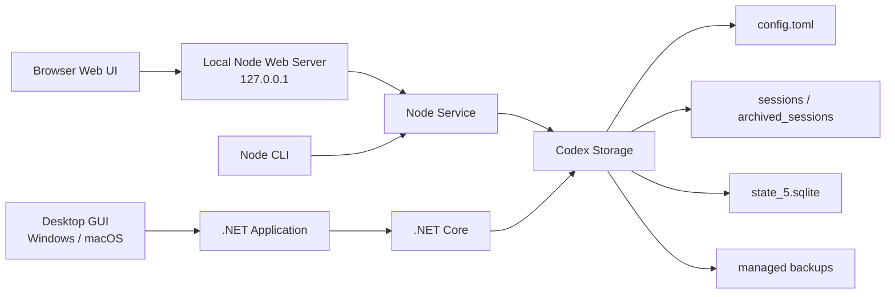

<div align="center">

# codex-provider-sync

### Provider 전환 후 Codex의 이전 세션을 다시 표시합니다

[](https://github.com/Dailin521/codex-provider-sync/actions/workflows/ci.yml)
[](https://github.com/Dailin521/codex-provider-sync/releases/latest)
[](../LICENSE)
[](https://linux.do/)

[Windows GUI 다운로드](https://github.com/Dailin521/codex-provider-sync/releases/latest) · [中文](../README.md) · [English](README_EN.md) · [日本語](README_JA.md) · 한국어

</div>

## 해결하는 문제

`model_provider`를 전환하면 이전 세션이 Codex Desktop 또는 `/resume`에서 사라질 수 있습니다. 데이터는 보통 디스크에 남아 있지만 세션 파일과 SQLite 인덱스의 Provider 정보가 동기화되지 않은 상태입니다.

이 도구는 세션 파일과 SQLite 인덱스를 동기화하여 세션 표시를 복원하고, 쓰기 전에 백업을 만듭니다. 로그인이나 계정 전환은 처리하지 않으며 `auth.json`이나 메시지 본문도 수정하지 않습니다.

## 빠른 시작

| 상황 | 권장 방법 |
| --- | --- |
| Windows 데스크톱 | [네이티브 Windows GUI](#windows-gui) |
| macOS 데스크톱 | [로컬 Web UI](#로컬-web-ui) / [네이티브 GUI 빌드 안내](README_MAC_GUI_EN.md) |
| 브라우저 UI 또는 크로스 플랫폼 사용 | [로컬 Web UI](#로컬-web-ui) |
| 스크립트, CI 또는 WSL | [CLI](#cli) |

### Windows GUI

[Releases](https://github.com/Dailin521/codex-provider-sync/releases/latest)에서 `CodexProviderSync.exe`를 다운로드합니다.

1. "새로 고침"을 클릭합니다.
2. 대상 Provider를 선택합니다.
3. "지금 동기화"를 클릭합니다.

프로그램은 코드 서명되지 않았으므로 Windows에서 보안 경고가 표시될 수 있습니다. 이 프로젝트의 Releases에서만 다운로드하세요.

[Windows GUI 전체 안내](README_GUI_ZH.md)

### 로컬 Web UI

CLI를 설치한 뒤 실행합니다.

```bash
codex-provider web
```


자주 쓰는 옵션:

```bash
codex-provider web --no-open       # 브라우저를 자동으로 열지 않음
codex-provider web --port 8792     # 포트 지정
codex-provider web --reset-access  # 브라우저 재페어링
```

Web UI는 기본적으로 `127.0.0.1`에서만 수신하며, 브라우저를 자동으로 열어 페어링을 진행합니다. 저장 경로는 Profile로 관리하고 쓰기 작업에는 확인이 필요합니다. Profile이 변경되면 다시 확인해야 합니다.

[Web UI 전체 안내](README_WEB_UI_ZH.md)

### CLI

CLI는 Node.js `16.20.2+`를 지원합니다. 설치하지 않았다면 다음을 실행합니다.

```bash
npm install -g git+https://github.com/Dailin521/codex-provider-sync.git
codex-provider status
codex-provider sync
```

| 명령 | 용도 |
| --- | --- |
| `codex-provider status` | Provider, rollout, SQLite 상태 확인 |
| `codex-provider sync` | 현재 Provider로 동기화 |
| `codex-provider switch <provider-id>` | Provider 전환 후 동기화 |
| `codex-provider restore <backup-dir>` | 백업 복원 |
| `codex-provider watch` | 설정과 SQLite 변경 감시 |

SQLite Home 해석 순서: `--sqlite-home` → `config.toml` 루트의 `sqlite_home` → `CODEX_SQLITE_HOME` → `<Codex Home>/sqlite`. 기본 레이아웃에서만 `<Codex Home>/state_5.sqlite`로 대체합니다.

## 현재 아키텍처



- Web UI와 CLI는 동일한 Node 서비스 로직을 사용합니다.
- Windows/macOS GUI는 Application 계층을 통해 .NET Core를 호출합니다.
- 두 경로는 동일한 설정, rollout, SQLite, 백업 안전 범위를 처리합니다.

## 안전 범위

- 매 `sync` / `switch` 전 `~/.codex/backups_state/provider-sync/<timestamp>`에 백업합니다.
- 메시지 본문, 세션 제목, 인증 정보, `auth.json`, `updated_at`은 수정하지 않습니다.
- SQLite가 사용 중이면 Codex, Codex App, app-server를 닫은 뒤 다시 시도하세요.
- 활성 세션이 rollout을 잠그면 나머지 파일은 계속 처리합니다. 세션 종료 후 다시 동기화하면 됩니다.
- Provider/account 간 `encrypted_content`는 목록 표시만 복원할 수 있습니다.
- Windows에서는 WSL UNC SQLite Home에 직접 쓸 수 없습니다. WSL에서 Linux 경로로 CLI를 실행하세요.

## 문서

- [AI / Agent 가이드](../AGENTS.md)

- [Windows GUI](README_GUI_ZH.md)
- [Web UI](README_WEB_UI_ZH.md)
- [中文](../README.md) · [English](README_EN.md) · [日本語](README_JA.md)
- [macOS GUI: 中文](README_MAC_GUI_ZH.md) · [English](README_MAC_GUI_EN.md)
- [작동 원리](WORKING_PRINCIPLE_ZH.md) · [변경 이력](../CHANGELOG.md) · [기여 안내](../CONTRIBUTING.md)

## 개발

```bash
npm ci
npm run web:build
npm run web:start
npm test
dotnet test desktop/CodexProviderSync.Core.Tests/CodexProviderSync.Core.Tests.csproj
```

## License

MIT
