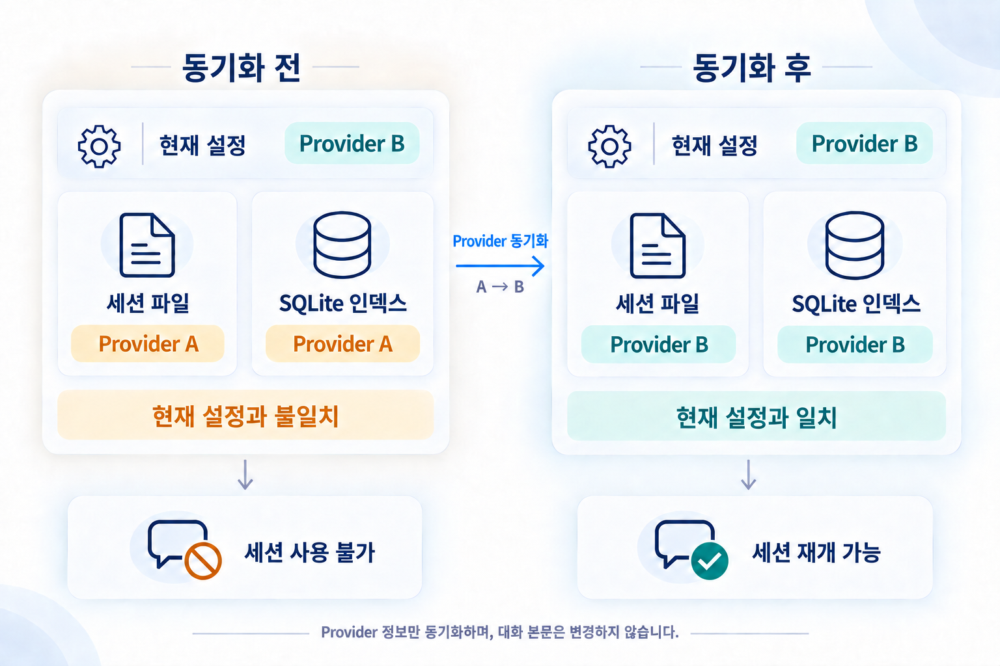
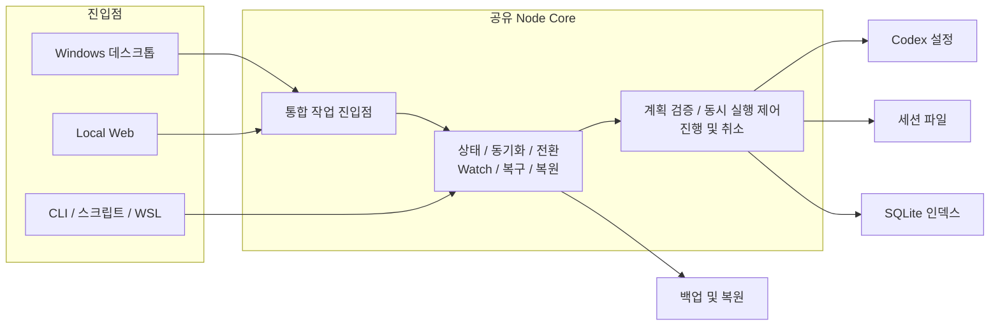

<div align="center">

# codex-provider-sync

### Provider 전환 후 기존 Codex 세션을 다시 사용할 수 있도록 돕습니다

[](https://github.com/Dailin521/codex-provider-sync/actions/workflows/ci.yml)
[](https://www.npmjs.com/package/@dailin521/codex-provider-sync)
[](https://github.com/Dailin521/codex-provider-sync/releases)
[](../LICENSE)
[](https://linux.do/)

[中文](../README.md) · [English](README_EN.md) · [日本語](README_JA.md) · **한국어**

</div>

<p align="center">
  
</p>

## 해결하는 문제

Provider를 전환한 뒤에도 기존 세션에는 이전 Provider가 기록되어 있을 수 있습니다. 이 도구는 **세션 파일과 SQLite 채팅 인덱스의 Provider 정보**를 현재 설정에 맞춰 메타데이터 불일치를 해결합니다.

**Provider나 계정 간 세션 계속 또는 compact를 보장하지 않으며**, 로그인, 인증, 암호화된 내용은 처리하지 않습니다. 정보가 이미 일치하면 다시 동기화할 필요가 없습니다.

### 언제 사용하나요?

- **CCSwitch 등으로 이미 전환한 경우:** 현재 설정의 Provider로 동기화합니다.
- **이 도구에서 전환하려는 경우:** 대상 Provider를 선택하면 설정을 변경한 뒤 세션 파일과 인덱스를 동기화합니다.
- **Provider 정보가 이미 일치하는 경우:** 다시 동기화할 필요가 없습니다. 계속할 수 없다면 Codex의 구체적인 오류를 확인하세요.

## 주요 기능

- **동기화와 전환:** 미리보거나 바로 동기화하고, 필요할 때 Watch를 켭니다.
- **백업과 복원:** 변경 전 자동 백업을 만들고 복원하거나 정리할 수 있습니다.
- **채팅과 로그:** 프로젝트별 세션, 작업 결과와 소요 시간을 확인합니다.
- **저장 위치와 복구:** 저장 위치를 지정하고 필요할 때만 진단이나 개별 복구를 실행합니다.

## Windows 데스크톱 앱 다운로드

**Windows x64**, Node.js가 필요하지 않습니다. 미서명 버전이며 포터블 ZIP은 전체를 압축 해제하세요.

[최신 정식 버전 다운로드: 설치 프로그램 / 포터블 ZIP, 릴리스 정보와 체크섬](https://github.com/Dailin521/codex-provider-sync/releases/latest)

macOS/Linux Electron 패키지는 아직 공개되지 않았습니다. CLI / Web npm 버전은 별도로 배포됩니다.

## 일상 사용

1. Overview를 열어 **Provider, 저장 경로, 동기화 상태**를 확인합니다.
2. CCSwitch 등으로 Provider를 전환했다면 **Preview sync**로 영향을 확인하거나 **Sync now**로 바로 실행합니다.
3. 결과를 확인합니다. partial이면 점유 중인 세션을 종료한 뒤 다시 시도하고, 되돌리려면 **Backups / Restore**로 이동합니다.

**Switch Provider separately**는 설정을 변경하고 기록 Provider를 동기화하지만 기록 모델은 바꾸지 않습니다. 사용자 지정 Provider는 미리 설정해야 합니다.

변경 전 자동으로 백업하며 기본적으로 최근 **2개**를 유지합니다. 변경할 내용이 없으면 백업을 만들지 않습니다.

[데스크톱 전체 가이드(영문)](README_DESKTOP_EN.md) · [구버전 마이그레이션 안내(중국어)](release-notes/v1.0.0-zh.md)

## 로컬 Web UI

Node.js `16.20.2+`를 설치한 뒤 공개된 CLI / Web npm 패키지를 실행합니다.

```bash
npm install -g @dailin521/codex-provider-sync
codex-provider web
```

기본값으로 `127.0.0.1:8791`에서만 수신하고 브라우저에서 페어링합니다. 다른 기기에서 사용하는 방법은 [Web 및 SSH 가이드(중국어)](README_WEB_UI_ZH.md)를 참조하세요.

## CLI

```bash
codex-provider status
codex-provider sync
```

CLI 쓰기 명령은 바로 실행됩니다. 전환, 복원, Watch, 경로, JSON 종료 코드는 [CLI 가이드(중국어)](README_CLI_ZH.md)를 참고하고, 사용 가능한 명령은 설치된 버전의 `--help`로 확인하세요.

## 하나의 코어, 세 개의 진입점

Windows 데스크톱 앱, Local Web, CLI는 같은 동기화·전환·백업·복원 로직을 사용합니다. 진입점은 조작 방식만 바꾸고 동기화 결과는 바꾸지 않습니다.



- **데스크톱 앱:** 일상적인 더블클릭 사용.
- **Local Web:** 브라우저에서 조작하는 크로스플랫폼 환경.
- **CLI:** 스크립트, 자동화, WSL.

일반 동기화는 Provider만 맞춥니다. 개별 복구와 복원은 명시적으로 선택해야 합니다. 구형 .NET Windows/macOS 앱은 호환 구현으로 유지합니다.

## 동기화의 쓰기 방식과 속도

동기화는 각 세션의 첫 메타데이터 줄만 해석하고 세션 파일과 SQLite의 Provider를 맞춥니다. 대화 본문은 바꾸지 않습니다.

- **Provider 바이트 길이가 같은 경우를 포함해 제자리 쓰기 조건을 만족하는 경우:** Provider를 직접 변경하고 전체 대체 파일을 만들지 않습니다.
- **그 밖의 유효한 첫 줄:** 첫 줄을 변경한 뒤 본문을 새 파일에 스트리밍 복사하고 원본을 교체합니다.

이 방식은 자동으로 선택됩니다. 가속 옵션이 필요 없고 Provider 이름 길이를 맞출 필요도 없습니다.

속도는 주로 변경할 세션 수에 따라 달라집니다. Provider 길이가 다르고 기록 파일이 크면 본문 복사가 필요합니다. 백업, 쓰기 전 확인, 저장, 타임스탬프 복원에도 시간이 걸립니다. 작업 로그에서 단계별 시간을 확인할 수 있습니다.

## 자주 묻는 질문

### CCSwitch로 이미 전환했습니다. 무엇을 해야 하나요?

도구를 열어 현재 Provider가 원하는 값인지 확인한 뒤 동기화합니다. 세션 파일과 인덱스의 Provider가 이미 일치하면 다시 동기화할 필요가 없습니다.

### 동기화가 대화 내용이나 로그인 정보를 바꾸나요?

아닙니다. 세션 파일과 SQLite 인덱스의 Provider만 맞춥니다. 대화 본문, 기록 모델, 세션 정렬 시간, `auth.json`은 읽거나 수정하지 않습니다.

### 동기화 후에도 이전 세션을 계속할 수 없는 이유는 무엇인가요?

Provider 일치는 계속 사용하기 위한 조건 중 하나입니다. Codex의 구체적인 오류를 확인하세요. 암호화된 내용 또는 모델 호환성 문제라면 원래 Provider/계정으로 돌아가거나 새 세션을 만드세요.

### “부분 완료”가 표시되면 어떻게 하나요?

결과나 작업 로그의 이유를 확인합니다. 문제가 있는 세션은 연결된 인덱스를 유지한 채 건너뛰고 정상 세션은 계속 처리합니다. 형식이나 크기 문제는 데이터를 고친 뒤 다시 미리보기하고, 점유되었거나 변경된 파일은 쓰기가 끝난 뒤 다시 동기화합니다. 완료된 변경은 자동으로 전체 롤백되지 않습니다.

### 잘못 동기화했으면 어떻게 복원하나요?

**Backups / Restore**에서 작업 전 백업을 선택해 복원합니다. CLI에서는 `codex-provider restore <backup-dir>`를 사용합니다.

경로 설정과 WSL은 [CLI 가이드(중국어)](README_CLI_ZH.md), 동기화 읽기/쓰기와 속도는 [작동 원리(중국어)](WORKING_PRINCIPLE_ZH.md)를 참조하세요.

## 문서와 개발

- [문서 색인(중국어)](README_ZH.md) · [변경 이력](../CHANGELOG.md) · [Issue 신고](https://github.com/Dailin521/codex-provider-sync/issues)
- [작동 원리(중국어)](WORKING_PRINCIPLE_ZH.md) · [현재 Node Core 아키텍처(중국어)](architecture/NODE_CORE_ARCHITECTURE_ZH.md)
- [기여 및 빌드](../CONTRIBUTING.md) · [마이그레이션과 릴리스 게이트](migration/VNEXT_MIGRATION_EXECUTION_INDEX_ZH.md) · [AI / Agent 가이드](../AGENTS.md)

```bash
npm ci
npm run architecture:check
npm test
npm run web:build
npm run desktop:build
```

## 감사의 말과 라이선스

로컬 Web UI, 기록 탐색과 다국어 문서 기반을 제공하고 [PR #80](https://github.com/Dailin521/codex-provider-sync/pull/80)을 통해 v0.5.0에 도입한 [@tangquanwei](https://github.com/tangquanwei), 그리고 코드, 문서, 테스트와 문제 조사에 기여한 모든 분께 감사드립니다.

[기여자](../CONTRIBUTORS.md) · [GitHub Contributors](https://github.com/Dailin521/codex-provider-sync/graphs/contributors) · [LINUX DO](https://linux.do/) · [MIT License](../LICENSE)
