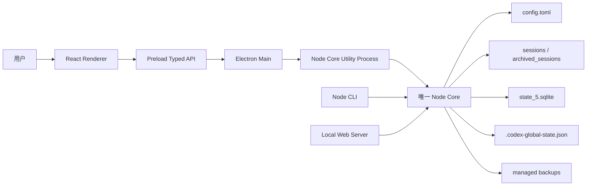
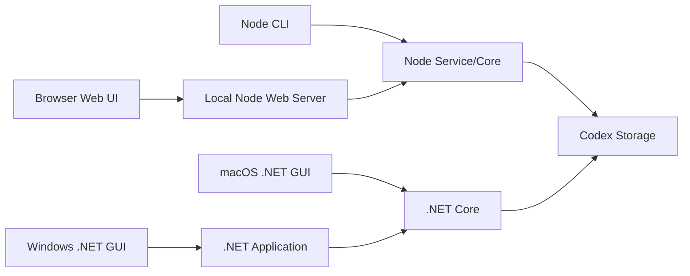
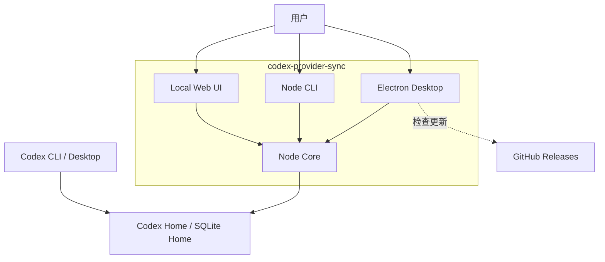
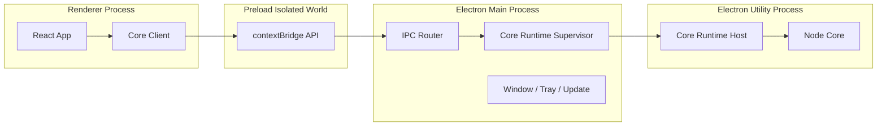
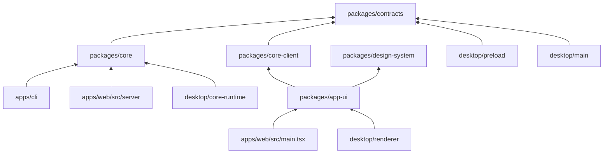
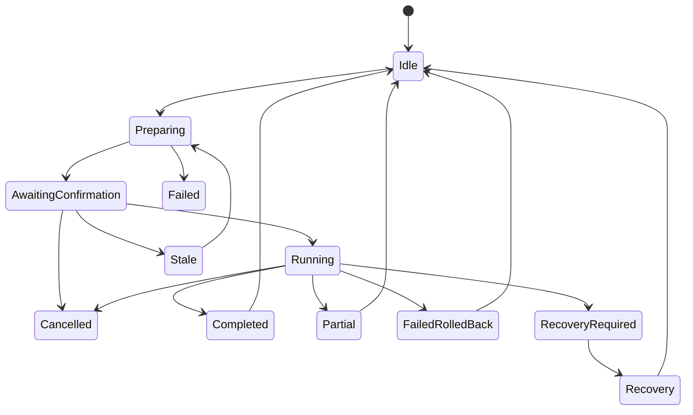
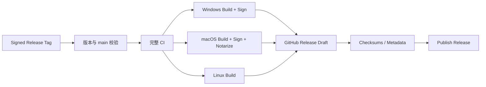

# codex-provider-sync vNext 成熟架构设计

> **技术路线：Electron + React + TypeScript + Node 单核心**  
> **文档状态：Accepted / 已确认（架构方向）**  
> **文档版本：1.0**  
> **基线日期：2026-08-17**  
> **最后修订：2026-08-24**  
> **适用仓库：`Dailin521/codex-provider-sync`**  
> **目标版本：vNext / 1.0 架构演进**  
> **配套 ADR：vNext/ADR-0001～0010 已 Accepted；导航见 [迁移执行索引](migration/VNEXT_MIGRATION_EXECUTION_INDEX_ZH.md)**

> 本文定义目标架构与分阶段迁移基线，不代表 `main` 已经完成该架构。迁移期间，当前代码、既有测试与已发布兼容合同仍是现状事实；只有达到对应阶段退出条件后，目标实现才能替代旧实现。

---

## 目录

- [0. 文档目的](#0-文档目的)
- [1. 架构决策摘要](#1-架构决策摘要)
- [2. 项目现状与约束](#2-项目现状与约束)
- [3. 架构目标](#3-架构目标)
- [4. 架构原则](#4-架构原则)
- [5. 目标系统架构](#5-目标系统架构)
- [6. 目标仓库结构](#6-目标仓库结构)
- [7. 依赖方向](#7-依赖方向)
- [8. Node Core 设计](#8-node-core-设计)
- [9. Plan / Revision / Apply 模型](#9-plan--revision--apply-模型)
- [10. 操作状态机](#10-操作状态机)
- [11. Core Runtime 消息协议](#11-core-runtime-消息协议)
- [12. Electron Main 架构](#12-electron-main-架构)
- [13. Preload 与 IPC 安全边界](#13-preload-与-ipc-安全边界)
- [14. React 前端架构](#14-react-前端架构)
- [15. 页面与信息架构](#15-页面与信息架构)
- [16. 数据与本地存储](#16-数据与本地存储)
- [17. SQLite 驱动策略](#17-sqlite-驱动策略)
- [18. 并发、锁和一致性](#18-并发锁和一致性)
- [19. 错误模型](#19-错误模型)
- [20. 安全架构](#20-安全架构)
- [21. 日志、诊断与遥测](#21-日志诊断与遥测)
- [22. 性能架构](#22-性能架构)
- [23. CLI 兼容架构](#23-cli-兼容架构)
- [24. Local Web UI 兼容](#24-local-web-ui-兼容)
- [25. 构建工具链](#25-构建工具链)
- [26. 签名、Notarization 与更新](#26-签名notarization-与更新)
- [27. 测试体系](#27-测试体系)
- [28. CI 架构](#28-ci-架构)
- [29. 版本与发布通道](#29-版本与发布通道)
- [30. 迁移路线](#30-迁移路线)
- [31. 首批 PR 拆分建议](#31-首批-pr-拆分建议)
- [32. 风险登记](#32-风险登记)
- [33. 代码审查门槛](#33-代码审查门槛)
- [34. AI / Codex 执行规则](#34-ai--codex-执行规则)
- [35. ADR 清单](#35-adr-清单)
- [36. Definition of Done](#36-definition-of-done)
- [37. 最终推荐](#37-最终推荐)
- [38. 参考依据](#38-参考依据)

---

## 0. 文档目的

本文是 `codex-provider-sync` 下一代架构的正式基线，用于指导：

- 维护者判断后续技术方向；
- Codex、其他 AI Agent 和贡献者实施重构；
- Node CLI、Local Web UI、Windows/macOS GUI 向统一产品演进；
- Windows、macOS、Linux 三个平台的构建、测试与发布；
- 在不破坏现有用户数据和 CLI 使用方式的前提下，消除 Node/.NET 双核心。

本文不是单纯的 UI 技术选型说明，也不是要求一次性推倒重写。它规定的是：

> **以现有 Node 业务实现为唯一权威核心，新增 Electron 跨平台桌面产品，并通过渐进迁移淘汰重复的 .NET 业务实现。**

---

## 1. 架构决策摘要

### 1.1 最终结论

```text
桌面产品：Electron
界面层：React + TypeScript
样式与组件：Tailwind CSS + shadcn/ui + Radix UI
唯一业务核心：Node Core
桌面进程通信：Preload + Typed IPC
长任务执行：Electron Utility Process 中运行同一 Node Core
CLI：继续保留现有 Node CLI，并调用同一 Node Core
Local Web UI：继续保留，逐步复用同一 React 应用层和 Node Core
应用自身数据库：不引入
Codex 数据事实源：config.toml / rollout / state_5.sqlite / global state
```

### 1.2 一句话架构

> React 负责“看见什么、如何交互”，Electron 负责“窗口和桌面能力”，Node Core 负责“所有同步、备份、恢复和数据安全规则”。

### 1.3 核心结构



### 1.4 不再采用的路线

| 路线 | 决策 | 原因 |
| --- | --- | --- |
| Tauri + Rust Core | 当前不采用 | 重写高风险核心，会扩大现有用户兼容责任 |
| Tauri + Node Sidecar | 不采用 | Rust → Sidecar → Node 增加无必要进程与打包复杂度 |
| Electron + .NET Core | 不采用 | 无法消除双核心 |
| Node Core + .NET Core 长期并存 | 不采用 | 同一安全逻辑继续重复维护 |
| Renderer 直接操作文件/SQLite | 禁止 | 绕过备份、锁、事务、回滚和权限边界 |
| 应用自建会话数据库 | 不采用 | Codex 原始存储才是事实源 |

---

## 2. 项目现状与约束

### 2.1 当前项目已经是正式用户产品

截至 2026-08-17，仓库已有约 3.2k Star 和 140+ Fork。现有用户已经通过以下方式接入：

```bash
npm install -g @dailin521/codex-provider-sync

codex-provider status
codex-provider sync
codex-provider switch <provider-id>
codex-provider restore <backup-dir>
codex-provider watch
codex-provider web
```

因此，重构必须把以下内容视为正式用户契约：

- npm 包名；
- `codex-provider` 可执行命令；
- 命令名称和参数；
- 默认路径解析；
- 退出码；
- 备份目录；
- 错误语义；
- `watch` 与 Local Web UI 行为；
- Node CLI 的自动化使用方式；
- WSL 和非桌面环境支持。

### 2.2 当前实现



当前主要问题不是功能不能运行，而是：

1. Node 与 .NET 都理解同一套同步业务；
2. 同一安全边界需要维护两份；
3. Windows、macOS、Web、CLI 的版本与能力容易漂移；
4. React Web UI 已出现巨型 `App.jsx` 和大体量全局 CSS；
5. 新功能需要在多个入口重复设计；
6. 发布流水线被 Node/npm 和 .NET GUI 拆成两套世界。

### 2.3 当前 Node Core 的价值

现有 Node 代码已经覆盖普通重写最容易遗漏的边界：

- rollout 流式扫描和流式改写；
- 等长原地覆盖与临时文件安全替换；
- 文件快照、大小和 mtime 校验；
- 活跃 rollout 锁处理；
- SQLite 识别、事务和 Busy 检测；
- `node:sqlite` 与 `better-sqlite3` 双驱动；
- 写入前备份；
- transaction journal；
- 失败补偿和恢复状态；
- WSL UNC 安全限制；
- workspace roots 修复；
- `encrypted_content` 风险提示；
- Local Web UI 的配对、Profile Revision 和 Storage Revision；
- 大量故障注入和回归测试。

因此 Node Core 不是“临时技术债”，而是当前最成熟的行为基线。

---

## 3. 架构目标

### 3.1 必须实现

1. **唯一业务核心**  
   CLI、Electron、Local Web UI 只调用同一 Node Core。

2. **正式跨平台桌面产品**  
   支持 Windows、macOS、Linux，用户不需要额外安装 Node.js。

3. **保持现有 CLI 用户兼容**  
   不因为 GUI 重构破坏 npm、脚本、WSL 和终端用户。

4. **安全优先**  
   所有写入继续遵循 Plan、确认、锁、备份、事务、验证、恢复。

5. **UI 与业务解耦**  
   React 不知道如何修改 rollout 或 SQLite。

6. **逐步替代 .NET**  
   在 Electron 达到行为等价后，再停用 .NET GUI，而不是先删旧实现。

7. **一套 UI 能力模型**  
   Electron Renderer 和 Local Web UI 尽量复用相同页面、组件、查询和表单逻辑。

8. **可验证迁移**  
   每个阶段都能通过自动化测试和真实平台构建验收。

### 3.2 明确不做

- 不在本次架构中重写 Rust Core；
- 不建立新的应用 SQLite 数据库；
- 不把项目扩展成通用 Provider 账号管理器；
- 不读写 `auth.json`、Token 或认证凭据；
- 不在 Renderer 开启 Node Integration；
- 不把历史消息正文当作日志或遥测数据；
- 不一次性把所有 JavaScript 改为 TypeScript；
- 不在首个 Electron 版本同时实现云同步、插件系统和远程控制；
- 不为追求“目录漂亮”制造一次巨大且难以审查的搬迁 PR。

---

## 4. 架构原则

### 4.1 单一权威核心

目标态下，所有核心业务只能存在于 `packages/core`。迁移期内，现有 `src/*.js` 是 Node 行为基线：阶段 1 先通过 `src/public-api.js` 收口入口，阶段 2 再建立 `packages/core` 并以独立、无行为变化的 PR 逐步迁入；迁移完成前不得复制出第二套实现。

核心业务包括：

- 状态扫描；
- Provider 对齐判断；
- 同步计划；
- Provider 切换；
- 备份；
- 恢复；
- Watch；
- Storage Layout；
- 锁；
- 事务日志；
- SQLite；
- rollout；
- workspace roots。

禁止以下重复：

```text
Electron IPC Handler 自己写同步流程
React 页面自己拼修改逻辑
CLI Command 自己直接修改 SQLite
Local Web API 自己重新解释业务规则
```

### 4.2 Codex 原始存储是事实源

```text
真实状态：Codex 原始文件和 SQLite
应用状态：缓存、视图、Profile、窗口设置、操作展示
```

应用不维护自己的 Session 主表，也不把扫描结果长期保存为“真相”。

### 4.3 Plan → Confirm → Apply

所有危险写操作都应分为：

```text
读取当前状态
    ↓
生成不可变 Plan
    ↓
向用户展示影响范围和警告
    ↓
用户确认
    ↓
重新校验 Revision / Snapshot
    ↓
执行写入
    ↓
验证与结果报告
```

### 4.4 Backup First

任何可能修改以下内容的操作，都必须先创建可恢复备份：

- `config.toml`；
- rollout；
- `state_5.sqlite`；
- global state；
- 与恢复相关的元数据。

### 4.5 UI 无本地高权限

Renderer 只能调用明确暴露的能力：

```ts
window.codexProvider.getStatus()
window.codexProvider.prepareSync()
window.codexProvider.applySync()
window.codexProvider.listBackups()
```

禁止暴露：

```ts
window.fs
window.require
window.ipcRenderer
window.exec
window.sqlite
```

### 4.6 进程职责清晰

| 层 | 允许做什么 | 禁止做什么 |
| --- | --- | --- |
| Renderer | UI、交互、表单、展示、查询状态 | 文件、SQLite、shell、业务规则 |
| Preload | 最小、类型化、白名单 API | 暴露原始 Electron/Node API |
| Main | 窗口、生命周期、安全策略、进程监督 | 执行长时间核心业务 |
| Core Utility Process | 执行 Node Core、进度、取消、Watch | 创建窗口、操作 Renderer |
| Node Core | 所有业务与数据安全 | 依赖 Electron、DOM、React |
| CLI Adapter | 参数解析、输出格式、退出码 | 复制核心业务 |
| Web Adapter | HTTP、配对、DTO 映射 | 复制核心业务 |

### 4.7 渐进迁移

- `main` 始终可发布；
- 默认按 ADR-0008 使用可独立合入的小型 PR；
- 经 ADR-0011 明确批准的 V1 例外使用单一 `V1` 分支和一个最终 PR，但 `C0`～`C10` 必须成为不可变、可独立审查和回退的内部 checkpoint；
- 分支 checkpoint 的验证不等于受保护分支的阶段 Completed，最终合入前 Phase 保持 In Progress/Pending；
- 旧 CLI 和旧 GUI 在迁移期间继续工作；
- 新 Electron 先只读，再开放写入；
- 不使用该例外放宽 Fixture、兼容、发布或 .NET 保留门槛。

---

## 5. 目标系统架构

### 5.1 系统上下文



### 5.2 Electron 进程结构



### 5.3 为什么增加 Utility Process

Electron Main Process 是窗口和整个应用的控制中心，不应承担：

- 大量 rollout 扫描；
- 同步 SQLite 调用；
- 大文件解析和重写；
- 备份复制；
- Watch 长任务；
- 故障注入和恢复。

因此桌面端推荐把 Node Core 放到 Electron 自带的 `utilityProcess` 中运行。

这不是 Tauri Sidecar，也不是第二套核心：

- 不需要用户安装 Node；
- 使用 Electron 自带的 Node Runtime；
- 加载的仍然是同一个 `@cps/core` 包；
- CLI 可以直接调用同一包；
- Utility Process 只是执行位置不同。

### 5.4 Utility Process 生命周期

```text
App Ready
  ↓
创建主窗口
  ↓
Renderer 首次请求核心能力
  ↓
Main 懒启动 Core Utility Process
  ↓
握手：协议版本 / 应用版本 / Core 版本
  ↓
处理请求、事件和取消
  ↓
崩溃时拒绝全部 Pending Request
  ↓
下次请求可重启 Runtime
  ↓
若存在未完成 Journal，UI 强制进入 Recovery 状态
```

核心进程不应为每次请求重新启动，而应在桌面会话中复用一个实例。

---

## 6. 目标仓库结构

### 6.1 最终结构

```text
codex-provider-sync/
├─ apps/
│  ├─ cli/
│  │  ├─ src/
│  │  │  ├─ cli.js
│  │  │  ├─ commands/
│  │  │  └─ presenters/
│  │  └─ package.json
│  │
│  ├─ desktop/
│  │  ├─ src/
│  │  │  ├─ main/
│  │  │  │  ├─ app-lifecycle.ts
│  │  │  │  ├─ windows.ts
│  │  │  │  ├─ ipc-router.ts
│  │  │  │  ├─ core-supervisor.ts
│  │  │  │  ├─ security.ts
│  │  │  │  ├─ updater.ts
│  │  │  │  └─ index.ts
│  │  │  ├─ preload/
│  │  │  │  ├─ api.ts
│  │  │  │  └─ index.ts
│  │  │  ├─ core-runtime/
│  │  │  │  ├─ host.ts
│  │  │  │  └─ index.ts
│  │  │  └─ renderer/
│  │  │     ├─ main.tsx
│  │  │     └─ desktop-client.ts
│  │  ├─ build/
│  │  │  ├─ icons/
│  │  │  ├─ entitlements.mac.plist
│  │  │  └─ installer/
│  │  ├─ electron.vite.config.ts
│  │  ├─ electron-builder.yml
│  │  └─ package.json
│  │
│  └─ web/
│     ├─ src/
│     │  ├─ main.tsx
│     │  ├─ http-client.ts
│     │  └─ server/
│     │     ├─ index.js
│     │     ├─ routes/
│     │     └─ pairing/
│     └─ package.json
│
├─ packages/
│  ├─ core/
│  │  ├─ src/
│  │  │  ├─ application/
│  │  │  ├─ domain/
│  │  │  ├─ infrastructure/
│  │  │  └─ public-api.js
│  │  └─ package.json
│  │
│  ├─ contracts/
│  │  ├─ src/
│  │  │  ├─ commands.ts
│  │  │  ├─ results.ts
│  │  │  ├─ events.ts
│  │  │  ├─ errors.ts
│  │  │  └─ protocol.ts
│  │  └─ package.json
│  │
│  ├─ core-client/
│  │  ├─ src/
│  │  │  ├─ client.ts
│  │  │  ├─ mock-client.ts
│  │  │  └─ query-keys.ts
│  │  └─ package.json
│  │
│  ├─ app-ui/
│  │  ├─ src/
│  │  │  ├─ app/
│  │  │  ├─ features/
│  │  │  ├─ components/
│  │  │  └─ hooks/
│  │  └─ package.json
│  │
│  ├─ design-system/
│  │  ├─ src/
│  │  │  ├─ components/
│  │  │  ├─ tokens/
│  │  │  └─ styles/
│  │  └─ package.json
│  │
│  └─ test-fixtures/
│     ├─ standard/
│     ├─ mixed-provider/
│     ├─ locked-rollout/
│     ├─ recovery-required/
│     └─ ...
│
├─ docs/
│  ├─ architecture/
│  ├─ adr/
│  ├─ migration/
│  └─ user/
│
├─ scripts/
├─ test/
├─ package.json
├─ package-lock.json
└─ AGENTS.md
```

### 6.2 Workspace 选择

继续使用 **npm workspaces**，不在架构迁移时额外切换 pnpm/yarn。

原因：

- 当前发布体系已经基于 npm；
- 用户通过 npm 安装 CLI；
- 减少一次无业务价值的工具链迁移；
- `package-lock.json` 可继续作为统一依赖锁。

### 6.3 迁移期目录策略

不要第一步就搬全部文件。建议：

```text
目录批次 A：保留 src/、web/、desktop/ 原位置
目录批次 B：建立 packages/core 与 apps/desktop 骨架
目录批次 C：按正式迁移阶段逐个迁移入口
目录批次 D：Electron 达到正式阶段 6 的稳定条件后，再移动 legacy .NET
```

目录迁移必须独立于业务行为改动，避免一个 PR 同时包含：

- 大量路径移动；
- JavaScript → TypeScript；
- 业务重构；
- UI 重写；
- 发布系统重写。

---

## 7. 依赖方向



### 7.1 禁止依赖

- `core` 禁止依赖 Electron；
- `core` 禁止依赖 React；
- `core` 禁止依赖 DOM；
- `app-ui` 禁止依赖 Electron；
- `renderer` 禁止依赖 `node:*`；
- `preload` 禁止依赖业务实现；
- `main` 禁止导入 Renderer 页面组件；
- CLI 和 Web Server 禁止直接导入 Core 内部文件，只能使用 `public-api`。

---

## 8. Node Core 设计

### 8.1 Core 的公开能力

建议形成稳定的公开 API：

```ts
export interface CodexProviderCore {
  getStatus(input: StatusInput): Promise<StatusSnapshot>;

  prepareSync(input: PrepareSyncInput): Promise<SyncPlan>;
  applySync(input: ApplySyncInput): Promise<OperationResult>;

  prepareSwitch(input: PrepareSwitchInput): Promise<SwitchPlan>;
  applySwitch(input: ApplySwitchInput): Promise<OperationResult>;

  listBackups(input: ListBackupsInput): Promise<BackupSummary[]>;
  prepareRestore(input: PrepareRestoreInput): Promise<RestorePlan>;
  applyRestore(input: ApplyRestoreInput): Promise<OperationResult>;
  pruneBackups(input: PruneBackupsInput): Promise<PruneResult>;

  listHistory(input: ListHistoryInput): Promise<HistoryPage>;
  getHistorySession(input: GetHistorySessionInput): Promise<HistorySession>;

  startWatch(input: StartWatchInput): Promise<WatchHandle>;
}
```

### 8.2 Application 层

Application 层表示完整用户操作：

```text
GetStatus
PrepareSync
ApplySync
PrepareSwitch
ApplySwitch
ListBackups
PrepareRestore
ApplyRestore
PruneBackups
ListHistory
StartWatch
```

Application 层负责：

- 编排完整流程；
- 生成 Plan；
- 检查 Revision；
- 调用备份、锁、SQLite、rollout 等基础能力；
- 返回稳定 Result；
- 发出进度事件；
- 统一错误分类。

### 8.3 Domain 层

Domain 层保存稳定概念：

- Provider ID；
- Storage Profile；
- Storage Revision；
- Operation Plan；
- Backup Metadata；
- Operation Result；
- Recovery State；
- Error Code；
- Progress Stage；
- Alignment State。

不应创建庞大的抽象实体或通用 ORM。该项目的 Domain 重点是**安全流程和数据一致性**，不是复杂商业对象。

### 8.4 Infrastructure 层

```text
infrastructure/
├─ config/
├─ rollout/
├─ sqlite/
├─ storage-layout/
├─ global-state/
├─ backup/
├─ locking/
├─ transaction-journal/
├─ history/
└─ watch/
```

Infrastructure 只负责“怎么读写”，不决定“为什么执行同步”。

### 8.5 Core 语言迁移策略

最终可以让 Node Core 大部分使用 TypeScript，但不能直接整体翻译。

推荐顺序：

1. 保留现有 ESM JavaScript 行为；
2. 开启 `checkJs`、JSDoc 类型和 `tsc --noEmit`；
3. 先迁移纯函数和低风险 DTO；
4. 再迁移 config、storage layout；
5. 最后迁移 `session-files`、`backup`、`locking`、`transaction-journal`、`service`；
6. 每迁移一个模块，先通过原有测试和行为兼容测试；
7. 编译产物仍然是普通 JavaScript，CLI 用户无需安装 TypeScript。

---

## 9. Plan / Revision / Apply 模型

### 9.1 为什么必须拆分

当前 Web UI 已经具备 Profile Revision、Storage Revision 和配置变更检测。桌面端应把它提升为 Core 的正式能力，而不是只存在于 HTTP Adapter。

### 9.2 Plan 示例

```ts
export interface SyncPlan {
  schemaVersion: 1;
  planId: string;
  createdAt: string;
  expiresAt: string;

  profile: {
    id: string;
    revision: string;
    codexHome: string;
    sqliteHome?: string;
  };

  storageRevision: string;
  configRevision: string;
  targetProvider: string;
  targetModel?: string | null;

  impact: {
    rolloutFilesToChange: number;
    sqliteRowsToChange: number;
    workspaceRootsToChange: number;
    lockedRolloutFiles: string[];
    encryptedContentProviders: Record<string, number>;
  };

  warnings: CoreWarning[];
  requiresConfirmation: true;
}
```

### 9.3 Apply 前重新校验

`applySync(planId)` 不得盲目信任几秒前的扫描结果，必须重新检查：

- Profile Revision；
- config 内容 Hash；
- SQLite Home 来源；
- 当前选中的 state DB；
- rollout 大小/mtime/snapshot；
- Pending Transaction；
- 进程锁；
- SQLite 可写性。

若任一绑定状态变化，Apply 返回统一的 Canonical Code：

```text
STALE_STATE
```

安全的 `details.reason` 可区分 `profile/config/storage/rollout/state-db`；调用方不得据此绕过重新 Prepare。Plan 超过 TTL 则返回 `PLAN_EXPIRED`。用户必须刷新并再次确认。

### 9.4 Plan 存储

- Core 内部保存完整 Plan；
- Renderer 只拿到可展示 Summary 和 `planId`；
- Plan 默认有短期 TTL；
- 应用重启后 Plan 失效；
- 不能把可执行 Plan 长期写入应用数据库；
- CLI 可以在同一进程中 Prepare 后立即 Apply。

---

## 10. 操作状态机



### 10.1 Result 类型

| Result | 含义 |
| --- | --- |
| `completed` | 全部计划成功执行 |
| `partial` | 非关键目标被锁或跳过，其他目标完成 |
| `failed_rolled_back` | 执行失败，但观察到的变更已恢复 |
| `recovery_required` | 自动恢复不完整，必须使用备份处理 |
| `cancelled` | 在安全取消点停止 |
| `stale` | Plan 与当前存储不再一致 |

### 10.2 取消规则

取消不是随时强制杀进程：

- 扫描阶段可以立即取消；
- 备份阶段只在文件边界取消；
- SQLite 已进入关键事务后延迟到安全点；
- 已经开始补偿恢复时禁止用户再次取消；
- 强制关闭应用后，Journal 必须能判断恢复状态。

---

## 11. Core Runtime 消息协议

### 11.1 协议消息

```ts
export type RuntimeMessage =
  | RuntimeHello
  | RuntimeRequest
  | RuntimeResponse
  | RuntimeEvent
  | RuntimeCancel
  | RuntimeShutdown;
```

请求：

```json
{
  "kind": "request",
  "protocolVersion": 1,
  "requestId": "req_123",
  "method": "prepareSync",
  "payload": {
    "profileId": "default"
  }
}
```

响应：

```json
{
  "kind": "response",
  "requestId": "req_123",
  "ok": true,
  "result": {}
}
```

事件：

```json
{
  "kind": "event",
  "operationId": "op_123",
  "event": {
    "stage": "create_backup",
    "status": "start",
    "progress": 0.35
  }
}
```

### 11.2 Supervisor 职责

Electron Main 中的 `CoreRuntimeSupervisor` 负责：

- 懒启动 Utility Process；
- 版本握手；
- requestId / Promise 映射；
- 超时；
- 进度转发；
- 取消；
- 进程退出处理；
- 日志收集；
- 应用退出时的优雅关闭。

### 11.3 Runtime 崩溃

如果 Utility Process 崩溃：

1. 所有 Pending Request 失败为 `CORE_RUNTIME_CRASHED`；
2. UI 显示明确错误，不伪装成业务失败；
3. Main 不自动无限重启；
4. 下一次用户主动重试时最多重启一次；
5. 重启后第一步检查 Pending Transaction；
6. 若存在未完成 Journal，禁止新写操作，进入 Recovery 页面。

---

## 12. Electron Main 架构

### 12.1 Main 负责

- 单实例锁；
- App 生命周期；
- BrowserWindow；
- 窗口状态；
- Tray（后期）；
- 自定义协议；
- 安全策略；
- IPC Handler；
- Core Runtime Supervisor；
- 更新检查；
- 原生文件选择器；
- 外部链接白名单；
- 崩溃与诊断入口。

### 12.2 Main 不负责

- Provider 对齐算法；
- rollout 扫描；
- SQLite SQL；
- 备份格式；
- Restore 规则；
- Watch 业务；
- 历史消息解析。

### 12.3 窗口建议

首版只使用一个主窗口：

```text
MainWindow
├─ Overview
├─ Sync
├─ Backups
├─ History
├─ Diagnostics
└─ Settings
```

避免初版引入多个窗口、悬浮窗和复杂托盘状态。原生确认弹窗只用于：

- 应用退出时仍有关键操作；
- 更新安装；
- 极端恢复场景。

普通业务确认使用 React Dialog，便于测试和跨平台一致。

---

## 13. Preload 与 IPC 安全边界

### 13.1 BrowserWindow 必须配置

```ts
new BrowserWindow({
  webPreferences: {
    preload: PRELOAD_PATH,
    nodeIntegration: false,
    contextIsolation: true,
    sandbox: true,
    webSecurity: true
  }
});
```

### 13.2 Preload 只暴露窄接口

```ts
contextBridge.exposeInMainWorld("codexProvider", {
  status: {
    get: (input) => ipcRenderer.invoke("cps:v1:status:get", input)
  },
  sync: {
    prepare: (input) => ipcRenderer.invoke("cps:v1:sync:prepare", input),
    apply: (input) => ipcRenderer.invoke("cps:v1:sync:apply", input),
    cancel: (operationId) => ipcRenderer.invoke("cps:v1:operation:cancel", { operationId })
  },
  operation: {
    subscribe: (callback) => {
      const listener = (_event, payload) => callback(payload);
      ipcRenderer.on("cps:v1:operation:event", listener);
      return () => ipcRenderer.removeListener("cps:v1:operation:event", listener);
    }
  }
});
```

### 13.3 禁止暴露原始 IPC

禁止：

```ts
contextBridge.exposeInMainWorld("electron", {
  send: ipcRenderer.send,
  invoke: ipcRenderer.invoke,
  on: ipcRenderer.on
});
```

### 13.4 IPC Handler 要求

每一个 Handler 都必须：

1. 验证 Sender Frame 来源；
2. 验证 Payload Schema；
3. 限制字符串长度和数组数量；
4. 不接受 Renderer 直接提交任意文件路径写入；
5. 转换为 Core Command；
6. 序列化错误；
7. 记录 operationId，但不记录消息正文和凭据；
8. 使用异步 IPC，禁止同步 IPC。

---

## 14. React 前端架构

### 14.1 技术栈

| 能力 | 选型 |
| --- | --- |
| UI | React + TypeScript |
| 构建 | Vite / electron-vite |
| 样式 | Tailwind CSS |
| 组件 | shadcn/ui + Radix UI |
| 图标 | Lucide |
| 查询状态 | TanStack Query |
| 表单 | React Hook Form |
| 校验 | Zod |
| 动画 | Motion，仅用于微交互 |
| 路由 | React Router Memory Router 或等价实现 |
| 国际化 | react-i18next 或等价方案 |
| 单元测试 | Vitest + Testing Library |
| E2E | Playwright Electron |

### 14.2 UI 目录

```text
packages/app-ui/src/
├─ app/
│  ├─ App.tsx
│  ├─ AppProviders.tsx
│  ├─ AppRouter.tsx
│  └─ ErrorBoundary.tsx
│
├─ features/
│  ├─ overview/
│  ├─ sync/
│  ├─ switch-provider/
│  ├─ backups/
│  ├─ restore/
│  ├─ history/
│  ├─ profiles/
│  ├─ diagnostics/
│  └─ settings/
│
├─ components/
│  ├─ layout/
│  ├─ feedback/
│  └─ operation/
│
├─ hooks/
├─ i18n/
└─ index.ts
```

### 14.3 防止巨型 App

`App.tsx` 只负责：

- 全局 Provider；
- 主布局；
- Router；
- Error Boundary；
- 全局 Toast；
- 更新提示。

以下内容禁止写入 `App.tsx`：

- Sync 表单；
- Status 数据转换；
- Restore 流程；
- History 解析；
- IPC 调用细节；
- 大量 Dialog；
- 页面专属状态。

### 14.4 状态归属

| 状态 | 存放位置 |
| --- | --- |
| Core Status、Backups、History | TanStack Query |
| Sync/Restore Mutation | TanStack Mutation |
| Input、Provider 配置 | React Hook Form |
| Dialog 开关 | 页面局部状态 |
| 主题、语言 | Settings Store |
| 当前 Operation | Operation Provider |
| Core Client | React Context / Dependency Injection |
| Codex 原始数据 | 不进入长期全局 Store |

不建议默认引入 Redux。只有出现复杂可回放全局状态后再评估。

### 14.5 Core Client 抽象

```ts
export interface CoreClient {
  getStatus(input: StatusInput): Promise<StatusSnapshot>;
  prepareSync(input: PrepareSyncInput): Promise<SyncPlanSummary>;
  applySync(input: ApplySyncInput): Promise<OperationAccepted>;
  listBackups(input: ListBackupsInput): Promise<BackupSummary[]>;
  subscribeOperation(listener: OperationListener): () => void;
}
```

实现：

```text
DesktopCoreClient → window.codexProvider / Electron IPC
HttpCoreClient    → Local Web API
MockCoreClient    → Story / Test / UI 开发
```

因此页面不能直接调用：

```ts
window.codexProvider...
fetch('/api/...')
```

页面只能调用 `CoreClient`。

### 14.6 Design System

Design System 至少定义：

- 色彩 Token；
- 字号；
- 间距；
- 圆角；
- 阴影；
- 状态色；
- Focus Ring；
- Dark/Light Theme；
- Reduced Motion；
- 状态 Badge；
- 危险操作组件；
- Progress Stage；
- Empty/Error/Recovery 页面。

Provider、Backup、Warning 等不能在每个页面自行设计不同样式。

### 14.7 可访问性

- 所有操作支持键盘；
- Dialog 正确管理焦点；
- Status 不只依赖颜色；
- Progress 使用可读文本；
- 支持系统 Reduced Motion；
- 最小点击目标；
- 表单错误关联 Label；
- 图标按钮有 `aria-label`；
- macOS 和 Windows 快捷键文案按平台变化。

---

## 15. 页面与信息架构

### 15.1 Overview

显示：

- 当前 Provider；
- 当前 model；
- Codex Home；
- SQLite Home 与来源；
- rollout / SQLite Provider 分布；
- 是否对齐；
- 锁定文件；
- Pending Transaction；
- 最近备份；
- 主要动作：刷新、同步。

### 15.2 Sync

流程：

```text
选择 Profile
  ↓
读取 Status
  ↓
生成 Sync Plan
  ↓
展示影响范围和警告
  ↓
用户确认
  ↓
实时进度
  ↓
结果 + 备份位置 + 跳过文件
```

### 15.3 Switch Provider

- 只展示 `config.toml` 中已配置 Provider 和内置 `openai`；
- 明确是否同步 root model；
- 支持 Keep Root Model；
- 未定义自定义 Provider 时不允许隐式创建；
- 先生成 Switch Plan。

### 15.4 Backups / Restore

- 列出托管备份；
- 显示 Provider、创建时间、覆盖内容、大小和恢复能力；
- Restore 前生成恢复计划；
- 跨 SQLite Home 恢复需要额外确认；
- Recovery Required 时该页面优先级最高。

### 15.5 History

- 只读；
- 默认不加载消息正文；
- 分页；
- 不写入日志；
- 用户主动打开具体会话后才读取；
- 不提供导出全部历史的首版能力。

### 15.6 Profiles

Profile 保存：

```ts
interface StorageProfile {
  id: string;
  name: string;
  codexHome: string;
  sqliteHome?: string;
  revision: string;
}
```

- 路径由 Main 原生文件/目录选择器选择；
- Renderer 不能提交任意“写文件路径”；
- 修改 Profile 后递增 Revision；
- 操作必须绑定 Profile Revision。

### 15.7 Diagnostics

- Core / Electron / App 版本；
- OS 和架构；
- 选中的 SQLite 驱动；
- 路径诊断；
- Pending Journal；
- 打包模式；
- 日志目录；
- 生成脱敏诊断包。

---

## 16. 数据与本地存储

### 16.1 不建立应用数据库

应用自身只需要轻量配置文件：

```text
Electron userData/
├─ settings.json
├─ profiles.json
├─ window-state.json
├─ logs/
└─ diagnostics/
```

建议复用现有原子写入能力：

```text
write temp
fsync
rename
```

### 16.2 数据分类

| 数据 | 事实源 | 是否持久化到应用目录 |
| --- | --- | --- |
| 当前 Provider | `config.toml` | 否 |
| Session Provider | rollout / SQLite | 否 |
| Session 内容 | rollout | 否 |
| Backup | Codex Home managed backup | 否 |
| Profile | 应用设置 | 是 |
| Theme / Language | 应用设置 | 是 |
| Window Position | 应用设置 | 是 |
| Status Snapshot | Core 实时读取 | 仅内存缓存 |
| Operation Plan | Core Runtime | 短期内存 |
| Operation Journal | Backup 目录 | 是，属于安全机制 |

### 16.3 Settings Schema Version

```json
{
  "schemaVersion": 1,
  "theme": "system",
  "language": "zh-CN",
  "updateChannel": "stable",
  "lastProfileId": "default"
}
```

配置迁移必须是单向、小步骤、可测试的。

---

## 17. SQLite 驱动策略

当前 Core 已支持：

```text
优先 node:sqlite
回退 better-sqlite3
```

保持该抽象。

### 17.1 CLI

- 现代 Node 优先使用 `node:sqlite`；
- 旧 Node 使用可选 `better-sqlite3`；
- npm 安装方式保持兼容；
- 缺少可用驱动时给出明确错误。

### 17.2 Electron

- Electron 自带 Node Runtime；
- 构建时检测 `node:sqlite` 能力；
- 若打包 `better-sqlite3`，必须针对 Electron ABI 重编译；
- native module 放入 `asarUnpack`；
- Windows x64、macOS x64/arm64、Linux x64 都运行 packaged smoke test；
- 每次 Electron Major 升级都执行 SQLite 驱动矩阵测试。

### 17.3 不使用 ORM

项目只操作少量明确的 Codex 表和字段。继续使用显式 SQL：

- 更容易审查；
- 更容易控制事务；
- 不产生 Schema Migration 幻觉；
- 不把 Codex 的数据库误认为应用自己的数据模型。

---

## 18. 并发、锁和一致性

### 18.1 进程内协调

Core Runtime 使用 `OperationCoordinator`：

- 同一个 Codex Home 同时只允许一个写操作；
- 写操作期间新的写请求返回 Busy 或排队；
- 状态读取在写操作完成后刷新；
- Watch 触发的同步不能抢占用户主动操作；
- Restore 优先于普通 Sync；
- Recovery Required 时禁止 Sync、Switch、Watch 自动同步等普通业务写；允许执行 recovery-safe 的 Prune，但不得删除任何 Pending Journal 引用的备份。

### 18.2 跨进程锁

同一 Codex Home 的所有正式入口必须遵守兼容的跨进程锁合同；vNext 对共享 SQLite Home 的双层资源身份、路径、顺序和错误语义由 [ADR-0012](adr/0012-dual-resource-lock-contract.md) 冻结，当前代码尚未实现该目标合同：

```text
CLI、Web UI、Electron、旧 GUI 同时运行
        ↓
跨进程锁保证同一目标不会并行写入
```

阶段 0/1 必须记录并验证现有 Node 与 .NET 锁的路径、命名、持有周期和冲突语义；只有跨进程互斥测试通过后，才能宣称迁移期旧 GUI 与新入口共享同一锁合同。若当前实现不兼容，应先统一合同，不能依赖 UI 层互相避让。

Electron 的 UI 禁用按钮只是体验优化，不能替代 Core Lock。

### 18.3 状态读取一致性

Status 应返回：

- `snapshotAt`；
- `storageRevision`；
- `operationInProgress`；
- `pendingRecovery`；
- `rolloutScanComplete`；
- `lockedRolloutFiles`。

UI 不应把部分扫描结果展示成“完全正常”。

---

## 19. 错误模型

### 19.1 稳定错误 DTO

```ts
interface CoreErrorDto {
  code: CoreErrorCode;
  message: string;
  severity: "info" | "warning" | "error" | "fatal";
  retryable: boolean;
  recoveryRequired: boolean;
  operationId?: string;
  details?: Record<string, unknown>;
  suggestedAction?: string;
}
```

### 19.2 关键错误码

```text
INVALID_INPUT
PROFILE_CHANGED
STORAGE_CHANGED
STALE_STATE
PLAN_EXPIRED
CODEX_HOME_NOT_FOUND
STATE_DB_NOT_FOUND
SQLITE_UNSUPPORTED_PATH
SQLITE_BUSY
SQLITE_UNREADABLE
ROLLOUT_LOCKED
ROLLOUT_CHANGED
PENDING_TRANSACTION
BACKUP_FAILED
SYNC_FAILED_ROLLED_BACK
RECOVERY_REQUIRED
RESTORE_VALIDATION_FAILED
PERMISSION_DENIED
OPERATION_BUSY
LOCK_UNVERIFIABLE
OPERATION_CANCELLED
CORE_RUNTIME_CRASHED
PROTOCOL_VERSION_MISMATCH
INTERNAL_ERROR
```

### 19.3 Renderer 展示规则

- 不根据英文 message 判断错误类型；
- 根据 `code` 决定页面和动作；
- `message` 用于详细说明；
- `RECOVERY_REQUIRED` 必须全局阻断普通写入；
- `SQLITE_BUSY` 明确提示关闭 Codex/App Server；
- `ROLLOUT_LOCKED` 显示为 Partial，不假装完全失败。

---

## 20. 安全架构

### 20.1 Electron 安全基线

必须满足：

- `nodeIntegration: false`；
- `contextIsolation: true`；
- `sandbox: true`；
- `webSecurity: true`；
- 只加载本地打包内容；
- 严格 CSP；
- 禁止任意导航；
- 禁止任意新窗口；
- 权限请求默认拒绝；
- 外部链接白名单；
- 校验 IPC Sender；
- 不使用 `@electron/remote`；
- 不暴露原始 `ipcRenderer`；
- Electron 保持在官方支持版本线内。

### 20.2 自定义协议

生产环境使用类似：

```text
cps-app://index.html
```

而不是直接依赖 `file://`。

开发环境可加载 Vite Dev Server，但仅在开发构建启用。

### 20.3 CSP 建议

```text
default-src 'self';
script-src 'self';
style-src 'self' 'unsafe-inline';
img-src 'self' data:;
font-src 'self';
connect-src 'self';
object-src 'none';
frame-src 'none';
base-uri 'none';
form-action 'none';
frame-ancestors 'none';
```

如 Tailwind 构建后不需要 inline style，应继续收紧。

### 20.4 导航和外链

- `will-navigate` 默认阻止；
- `setWindowOpenHandler` 默认 deny；
- 只有经过白名单验证的 HTTPS 链接才能 `shell.openExternal`；
- 禁止把用户或会话内容拼成 URL；
- GitHub、文档和 Release 链接集中在一个 allowlist 模块。

### 20.5 权限

桌面 UI 不需要：

- 摄像头；
- 麦克风；
- 屏幕捕获；
- 定位；
- USB/HID/Serial；
- 通知读取；
- 浏览器 File System API。

权限检查和请求默认全部拒绝。

### 20.6 Electron Fuses

生产打包阶段评估并锁定：

- 禁止 Run As Node；
- 禁止 Node Options 环境变量；
- 禁止生产 CLI Inspect；
- 启用 ASAR Integrity；
- 仅从 ASAR 加载应用代码。

实际 Fuse 组合必须经过 packaged smoke test，不能直接照抄模板。

### 20.7 数据隐私

除用户主动打开本地 History 会话外，Core 写操作、日志、诊断和遥测永远不得读取、复制、记录或上传：

- `auth.json`；
- API Key；
- Token；
- Cookie；
- 完整消息正文；
- `encrypted_content` 内容。

History 只在用户主动查看时读取完整消息正文，并且仅用于本地展示；正文不得进入应用数据库、持久缓存、日志、诊断包或遥测。日志只记录数量、路径类别、错误码和 operationId。

---

## 21. 日志、诊断与遥测

### 21.1 默认无遥测

首版不默认收集远程遥测。

原因：

- 项目操作本地 Codex 数据；
- 用户信任优先；
- 开源项目无需为了“数据完整”引入隐私负担。

### 21.2 本地日志

日志包含：

- 时间；
- App/Core/Electron 版本；
- operationId；
- stage；
- error code；
- 影响数量；
- 路径经过 Home 缩写或 Hash；
- Runtime 崩溃信息。

日志不包含：

- 消息正文；
- Token；
- Provider 认证字段；
- rollout 完整 JSON；
- SQLite 行完整内容。

### 21.3 日志轮转

建议：

```text
单文件 ≤ 5 MB
保留 ≤ 5 个文件
Debug 日志默认关闭
用户导出诊断包时再次脱敏
```

### 21.4 诊断包

用户主动导出：

```text
diagnostics.zip
├─ app-info.json
├─ status-summary.json
├─ storage-layout.json
├─ recent-redacted-logs/
└─ pending-transaction-summary.json
```

不包含真实 rollout 和数据库。

---

## 22. 性能架构

### 22.1 核心原则

- Main Process 不执行长任务；
- Core Runtime 懒启动；
- 首屏不等待完整历史扫描；
- 首页先显示 Shell 和最近 Profile；
- Status 扫描显示阶段性进度；
- 大 rollout 继续流式处理；
- History 分页；
- 不把整个会话列表长期放入 React 全局状态；
- 使用 Query Cache，但设置合理失效时间。

### 22.2 初始性能目标

以下是工程预算，不是对所有机器的宣传承诺：

| 指标 | 初始目标 |
| --- | --- |
| 主窗口可见 | 参考机器冷启动 1.5 秒左右 |
| UI 首次可交互 | 不等待 Core 完整扫描 |
| Main 阻塞任务 | 单次不超过约 50 ms |
| Renderer 输入响应 | 普通操作约 100 ms 内反馈 |
| Status 扫描 | 必须显示 Progress，可取消 |
| Idle CPU | 无 Watch 时接近 0 |
| Watch | 防抖、合并事件、不忙轮询 |
| History | 虚拟列表或分页，避免一次渲染全部 |

任何性能结论都应基于 Packaged Build 测量，而不是 Dev Server。

### 22.3 启动顺序

```text
显示窗口
  ↓
加载主题 / 语言 / Profile
  ↓
首屏 Skeleton
  ↓
懒启动 Core Runtime
  ↓
读取轻量 Status
  ↓
后台检查更新
  ↓
用户进入 History 时才加载历史能力
```

---

## 23. CLI 兼容架构

### 23.1 保留命令

```text
status
sync
switch
restore
watch
web
prune-backups
install-windows-launcher（可在后续评估）
```

### 23.2 新增机器可读输出

建议逐步增加：

```bash
codex-provider status --json
codex-provider sync --json
codex-provider switch openai --json
codex-provider restore <backup> --json
```

JSON 输出：

- 使用稳定 Schema Version；
- stdout 只输出 JSON；
- 日志和人类提示写 stderr；
- 退出码稳定；
- 不把 Error Stack 默认输出给普通用户。

### 23.3 退出码建议

| Exit Code | 含义 |
| --- | --- |
| `0` | 完成或无需修改 |
| `1` | 普通失败 |
| `2` | 参数错误 |
| `3` | Partial，存在锁定文件 |
| `4` | Recovery Required |
| `5` | Busy / Another Operation |
| `130` | 用户取消 / SIGINT |

现有脚本已经依赖退出码时，应先调查再固定；不能直接更换。

### 23.4 Node 版本政策

- 现有 v0.x 继续遵守当前最低 Node 契约；
- Electron 构建工具使用现代 LTS Node；
- 不因为新增 Electron 就强制 CLI 用户立刻升级；
- 如果 v1 需要提高最低 Node，必须作为 Major 变更公告；
- npm 包继续输出编译后的 JavaScript。

### 23.5 CLI 与 Desktop 的关系

- Desktop 不调用 CLI 文本；
- Desktop 不解析 stdout；
- Desktop 与 CLI 都调用 Core Public API；
- `--json` 是外部自动化合同，不是 Electron 内部 IPC。

---

## 24. Local Web UI 兼容

### 24.1 保留价值

Local Web UI 仍适合：

- 不想安装桌面客户端的用户；
- 远程桌面或受限环境；
- 开发调试；
- Node CLI 用户；
- Electron 尚未支持的平台。

### 24.2 复用目标

```text
同一 packages/app-ui
├─ DesktopCoreClient（IPC）
└─ HttpCoreClient（localhost HTTP）
```

桌面与 Web 可以有少量能力差异：

| 能力 | Desktop | Web |
| --- | --- | --- |
| 文件夹选择 | 原生 Dialog | Server Profile API |
| 自动更新 | 支持 | 不适用 |
| Tray | 支持 | 不适用 |
| 配对 | 不需要 | 需要 |
| Core 通信 | IPC | localhost HTTP |

### 24.3 Web 安全能力不能倒退

保留：

- 只监听 `127.0.0.1`；
- 一次性配对；
- Device Credential；
- Profile Revision；
- Storage Revision；
- Request Size 限制；
- CSP；
- 路径由服务器 Profile 管理；
- 写操作明确确认。

---

## 25. 构建工具链

### 25.1 推荐组合

```text
Electron
+ electron-vite
+ electron-builder
+ React / TypeScript / Vite
```

选择原因：

- 当前 Web UI 已经使用 Vite；
- electron-vite 同时处理 Main、Preload、Renderer；
- electron-builder 覆盖 Windows/macOS/Linux 安装包、签名和更新；
- 避免 Electron Forge Vite 插件当前仍标记为 Experimental 所带来的额外版本风险。

### 25.2 版本策略

- Electron 使用精确版本，不使用宽松 `^`；
- electron-vite、electron-builder、native module 精确锁定；
- 每月或每个安全发布窗口升级；
- Electron 保持在官方支持的最近版本线；
- 升级 Electron 时必须运行全平台 Packaged Smoke Test；
- 不在功能 Release 临时升级 Electron Major。

### 25.3 打包目标

| 平台 | 架构 | 首发格式 |
| --- | --- | --- |
| Windows | x64 | NSIS Installer + Portable ZIP（可选） |
| macOS | arm64 | DMG + ZIP |
| macOS | x64 | DMG + ZIP |
| Linux | x64 | AppImage + deb |

后续根据真实需求增加：

- Windows arm64；
- Linux arm64；
- rpm；
- Flatpak。

### 25.4 Artifact 命名

```text
CodexProviderSync-1.0.0-windows-x64-setup.exe
CodexProviderSync-1.0.0-windows-x64-portable.zip
CodexProviderSync-1.0.0-macos-arm64.dmg
CodexProviderSync-1.0.0-macos-x64.dmg
CodexProviderSync-1.0.0-linux-x64.AppImage
CodexProviderSync-1.0.0-linux-x64.deb
SHA256SUMS.txt
```

---

## 26. 签名、Notarization 与更新

### 26.1 Windows

稳定版目标：

- Authenticode 签名；
- Installer 和可执行文件均签名；
- Timestamp；
- CI Secret 保护；
- 证书轮换文档化。

签名成本未解决前：

- Preview 明确标记未签名；
- 发布 SHA256；
- 只从 GitHub Releases 分发；
- README 说明警告原因；
- 不伪装成已签名版本。

### 26.2 macOS

稳定发布必须：

- Developer ID 签名；
- Hardened Runtime；
- Notarization；
- Staple Ticket；
- x64 与 arm64 分别验证；
- 在 macOS Runner 构建。

### 26.3 自动更新

建议使用 `electron-updater` + GitHub Releases：

- Stable / Beta Channel 分离；
- 应用启动后延迟检查；
- 正在执行写操作时不安装；
- Pending Recovery 时禁止更新重启；
- 更新下载完成后由用户确认重启；
- Windows、macOS 和 AppImage 先支持；
- deb 用户首版可仅通知新版。

### 26.4 更新安全规则

- 只信任正式 Release；
- 不从任意 URL 更新；
- 不在 Renderer 实现更新下载；
- 更新错误不能影响 Core 操作；
- Release 撤回必须发布更高版本修复，不能覆盖同版本资源。

---

## 27. 测试体系

### 27.1 测试金字塔

```text
Packaged E2E / Real OS Smoke
            ▲
Electron IPC / Runtime Integration
            ▲
React Feature / Component Tests
            ▲
Core Integration / Fault Injection
            ▲
Core Unit Tests
```

### 27.2 Core 测试

现有 `node:test` 测试应继续保留，不因 UI 重构整体改为 Vitest。

重点覆盖：

- config；
- storage layout；
- SQLite 驱动；
- rollout 扫描；
- 大文件；
- 锁；
- 备份；
- transaction journal；
- rollback；
- restore；
- watch；
- WSL；
- fault injection；
- web profile revision。

### 27.3 行为兼容 Fixtures

```text
packages/test-fixtures/
├─ default-openai/
├─ custom-provider/
├─ mixed-provider/
├─ archived-sessions/
├─ implicit-openai/
├─ root-model/
├─ custom-sqlite-home/
├─ legacy-state-db/
├─ dual-state-db-candidates/
├─ locked-rollout/
├─ active-rollout-changing/
├─ encrypted-content/
├─ large-rollout/
├─ malformed-rollout/
├─ sqlite-busy/
├─ pending-journal/
├─ restore-relocation/
├─ workspace-roots/
└─ wsl-unc/
```

每个 Fixture 要包含：

- 输入状态；
- 预期 Status；
- 预期 Plan；
- 预期写入；
- 不得变化的字节/字段；
- 预期 Backup；
- 预期 Restore 结果；
- 预期错误码。

### 27.4 .NET 对照测试

迁移期用 Node 与 .NET 对同一 Fixture 运行：

```text
同一输入副本
  ├─ Node Core
  └─ .NET Core
        ↓
比较语义结果、目标字段、备份覆盖和错误分类
```

Node 是目标核心，但 .NET 可以作为已有行为证据。差异必须：

- 明确哪一方正确；
- 补测试；
- 写迁移记录；
- 不静默选择。

### 27.5 Contract 测试

检查：

- Core DTO 可序列化；
- IPC Schema 与 Core Schema 一致；
- Web API 与 Desktop Client 表达相同语义；
- Error Code 不随 message 改变；
- Protocol Version 不兼容时明确失败。

### 27.6 Renderer 测试

使用 Vitest + Testing Library：

- Status 页面；
- Plan 确认；
- Partial Result；
- Recovery Required；
- Profile Changed；
- Progress；
- Cancel；
- Error Boundary；
- i18n；
- Keyboard Navigation。

所有 UI 测试使用 `MockCoreClient`，不依赖真实 Electron。

### 27.7 Electron E2E

使用 Playwright Electron：

- 启动应用；
- 验证安全配置；
- Mock 原生 Dialog；
- 加载临时 Codex Home；
- Status；
- Prepare Sync；
- Apply Sync；
- 进度；
- Restore；
- Runtime Crash；
- Pending Recovery；
- 截图回归。

测试只能使用临时目录和 Fixtures，禁止接触开发者真实 `~/.codex`。

### 27.8 Packaged Smoke Test

不能只测试 Dev Build。每个平台至少测试：

1. 安装/解压；
2. 启动；
3. Runtime 启动；
4. SQLite Driver；
5. 临时 Fixture Status；
6. 一次 Sync + Restore；
7. 退出；
8. 卸载或清理。

---

## 28. CI 架构

### 28.1 Pull Request CI

以下 YAML 是结构伪代码；`最低支持版本` 与 `当前 LTS` 不是可直接写入 Workflow 的字面值。实际矩阵必须从 `package.json#engines`、仓库锁定的构建工具链和正式支持政策读取明确版本。

```yaml
core-test:
  matrix:
    os: [windows-latest, ubuntu-latest, macos-latest]
    node: [最低支持版本, 当前 LTS]

typecheck-lint:
  node: 当前 LTS

renderer-test:
  node: 当前 LTS

electron-integration:
  matrix:
    os: [windows-latest, ubuntu-latest, macos-latest]

package-smoke:
  matrix:
    os: [windows-latest, ubuntu-latest, macos-latest]
```

### 28.2 Required Gate

统一 `ci-gate` 检查：

- Core Tests；
- Typecheck；
- Lint；
- Web Build；
- Electron Build；
- Electron Integration；
- Packaged Smoke；
- Legacy .NET Tests（迁移期间）。

### 28.3 Nightly

Nightly 负责高成本测试：

- 大型 rollout；
- 多 Electron/Node 组合；
- 全平台 package；
- 自动更新测试；
- 安全扫描；
- 安装器验证；
- 长时间 Watch；
- 内存和启动性能基线。

### 28.4 Release CI



### 28.5 Release 必须失败关闭

以下任一失败，不发布：

- 版本不一致；
- Tag 不在 main；
- Core Test；
- Packaged Smoke；
- native SQLite 加载；
- macOS Notarization；
- Windows 签名（签名阶段启用后）；
- Artifact 缺失；
- Update Metadata 缺失。

---

## 29. 版本与发布通道

### 29.1 通道

```text
Stable
Beta
Nightly（仅开发者）
```

### 29.2 迁移期版本

建议：

```text
0.5.x       现有 Node / .NET 稳定维护
1.0.0-alpha Electron 只读和架构验证
1.0.0-beta  Electron 写能力开放
1.0.0-rc    功能冻结、跨平台发布验证
1.0.0       Electron 成为默认桌面产品
```

### 29.3 npm 与桌面版本

迁移期可独立发布，但必须明确：

- CLI Package Version；
- Desktop Version；
- Core Protocol Version；
- Backup Metadata Version；
- IPC Protocol Version。

v1 稳定后，建议统一仓库 Release 说明，并在兼容范围内尽量对齐版本。

---

## 30. 迁移路线

### 阶段 0：冻结决策与安全合同

交付：

- 本架构文档；
- ADR；
- Core 外部行为清单；
- CLI 命令合同；
- Error Code 清单；
- 测试 Fixture 清单。

规则：

- .NET 仅修严重 Bug；
- 不继续增加另一套大型业务能力；
- Node Core 仍是功能开发主线。

### 阶段 1：提取 Node Core，不改行为

目标：

```text
当前 src/*.js
     ↓
明确 public-api
     ↓
CLI / Web 都通过 public-api
```

动作：

- 拆 `service.js` 中展示逻辑和业务逻辑；
- CLI Presenter 移出 Core；
- Web DTO 映射移出 Core；
- Core 只返回结构化数据；
- 加入 `--json`；
- 不改同步算法；
- 原测试全部通过。

### 阶段 2：Contracts 与 Core Client

交付：

- `packages/core`（先封装阶段 1 已收口的 Node Core，再以独立 PR 逐模块迁移；不与业务改动混在一起）；
- `packages/contracts`；
- `CoreErrorDto`；
- Progress Event；
- `CoreClient`；
- `HttpCoreClient`；
- `MockCoreClient`；
- API Schema Version。

同时开始拆当前巨型 React App，但 Web UI 行为保持不变。

### 阶段 3：Electron Read-only Alpha

Electron 只开放：

- App 启动；
- Profiles；
- Status；
- Backup List；
- Diagnostics；
- History 只读（可选）；
- 跨平台 Package。

禁止：

- Sync；
- Switch；
- Restore；
- Watch 自动写入。

验收：

- Windows/macOS/Linux Packaged Build；
- Renderer 无 Node；
- Utility Process 正常；
- Status 与 CLI 结果一致；
- Runtime Crash 能恢复；
- 不访问真实用户数据的 E2E。

### 阶段 4：Sync / Switch Beta

开放：

- Prepare Sync；
- Apply Sync；
- Prepare Switch；
- Apply Switch；
- Progress；
- Cancel；
- Partial Result；
- Backup 跳转。

验收：

- 与 Node CLI 同一 Core；
- Plan Stale 处理；
- SQLite Busy；
- Locked Rollout；
- Fault Injection；
- Sync 后 Restore 回原状态。

### 阶段 5：Restore / Watch / 完整功能

开放：

- Restore；
- Prune；
- Watch；
- Recovery Required；
- Update；
- 诊断包。

### 阶段 6：Electron Stable，替代 .NET

条件：

- 三平台稳定；
- 关键功能等价；
- 无已知数据破坏 Bug；
- Beta 用户验证；
- 文档完整；
- Installer/签名策略明确；
- 旧备份可恢复；
- 新备份 CLI 可恢复；
- .NET 功能没有独占能力。

动作：

- README 默认推荐 Electron；
- .NET 标记 Legacy；
- 保留至少两个维护发布周期；
- 不立即删除旧 Release。

### 阶段 7：清理 Legacy

- 停止 .NET 正常 CI；
- 保留 legacy tag/branch 和文档；
- 从 active source tree 移出；
- 删除重复业务代码；
- 保留迁移说明；
- Node CLI 永久保留，除非未来另有独立 ADR。

---

## 31. V1 内部 Checkpoint 序列

在 ADR-0011 的单最终 PR 例外下，以下 `C0`～`C10` 是 V1 分支内的不可变 checkpoint，不是已经合入的独立 PR。旧 PR 2～PR 10 的依赖与安全意图按 ADR-0011 映射到这些 checkpoint。每个 checkpoint 必须保留 commit、测试证据和回退点；所有 Phase 状态仍以最终合入受保护分支为准。

### C0：V1 交付治理、双层锁与 Restore v2 文档合同

- 新增 ADR-0011～ADR-0013；
- 使架构、执行索引、Core/Error/Fixture 合同对单最终 PR、共享 State DB 锁与 Restore v2 目标可互相导航；
- 固化基线测试与依赖审计，并消除现有 Vite 链的 high/moderate 告警；
- 不把目标合同描述为已经实现。

### 已完成基线：PR 1（阶段 0 原合同）

- 以本文件作为已确认的架构基线；
- 新增 ADR-0001～ADR-0010；
- 补齐 Core 外部行为、CLI、Error Code 与 Fixture 清单；
- 更新 `AGENTS.md` 中的 ADR 入口；
- 不改运行代码。

### C1：Core Public API 与结构化错误

- 新增 `src/public-api.js`；
- CLI 和 Web 改为只从 Public API 导入；
- 不移动核心模块或改变事务顺序；
- 统一 Canonical Error Code 与 Legacy Adapter；
- 保持现有人类提示；
- 增加 Public API、错误合同和入口隔离测试。

### C2：CLI `--json`

- Human Mode 保持 v0.5 兼容；
- JSON Mode stdout 只输出一个版本化 envelope，进度与诊断进入 stderr；
- 固定 JSON Mode Exit Code 并以真实子进程测试。

### C3：Prepare / Apply、协调器与双层锁

- 把 Web Revision 逻辑下沉为 Core Plan/Apply；
- Sync、Switch、Restore 使用短期、单次、锁内重校验的 planId；
- Node 与迁移期 .NET 实现 Codex Home → State DB resource 双层锁；
- Watch 合并事件并让位于人工操作；
- CLI 内部仍一次完成；
- 兼容现有命令。

### C4：Workspace、Contracts 与 Core Client

- npm workspaces；
- `packages/core`，先包装阶段 1 的 `src/public-api.js`，不改变业务行为；
- `packages/contracts`；
- `packages/core-client`；
- 根 npm 包继续独立提供 Node 16 CLI，Electron 依赖不进入其 tarball。

### C5：共享 React UI 与 Web 迁移

- 建立 AppShell、Design System、九个 feature 页面、i18n 和主题；
- Web 通过 `HttpCoreClient` 复用 `app-ui`；
- 保留 pairing、Origin、Profile/Storage Revision、History 隐私边界。

### C6：Electron 安全骨架、Utility Runtime 与只读能力

- electron-vite；
- electron-builder；
- Main/Preload/Renderer/Core Utility Process 边界；
- 安全 BrowserWindow、白名单 IPC、Hello/Version 握手与 crash recovery；
- 只开放 Profile、Status、Backup、Diagnostics 和按需 History。

### C7：Electron Sync / Switch

- 只经 Prepare/Confirm/Apply 开放写入；
- Provider 与三种 model 策略；
- Progress、Cancel、Partial、Backup-first 与安全 Fixture。

### C8：Restore / Watch / Diagnostics / Update

- Restore v2 恢复前 snapshot、独立 journal、补偿与 ack reconciliation；
- Foreign Pending、Prune 保护、Watch 优先级、脱敏诊断包；
- Main-only 更新，写入或 Pending Recovery 时禁止安装。

### C9：打包、CI 与发布工程

- 四个目标平台产物、native SQLite、asar 审计、SBOM 与 checksums；
- Electron integration 与 packaged smoke 纳入唯一 `ci-gate`；
- CI 只生成候选 artifact，不自动发布。

### C10：最终证据与 Legacy 交接

- 同步最新 `main` 并重跑全部门禁；
- README 默认推荐 Electron，.NET 保留并标记 Legacy；
- 生成脱敏 evidence bundle；
- tag、npm/GitHub Release、签名、公证和更新通道继续等待单独授权。

---

## 32. 风险登记

| 风险 | 概率 | 影响 | 缓解 |
| --- | --- | --- | --- |
| Electron 包体积引发用户反感 | 中 | 中 | 透明说明、测量、提供 CLI、延迟加载 |
| Electron Main 被 Core 阻塞 | 中 | 高 | Utility Process、异步 IPC、性能测试 |
| Native SQLite 打包失败 | 中 | 高 | node:sqlite 优先、ABI 重建、asarUnpack、全平台 smoke |
| React 重写时功能丢失 | 中 | 高 | Shared CoreClient、Feature 对照、E2E |
| .NET 与 Node 行为不一致 | 高 | 中 | Fixtures、差异记录、明确权威行为 |
| CLI 用户被破坏 | 中 | 极高 | 命令合同、`--json`、SemVer、回归测试 |
| Electron 安全配置错误 | 中 | 高 | Security Checklist、IPC 白名单、CSP、Electronegativity/审计 |
| 更新导致操作中断 | 低 | 极高 | 写操作期间禁止安装更新、Journal、延迟重启 |
| Runtime 崩溃后状态不明 | 低 | 极高 | Journal、Pending Recovery、Supervisor |
| 长期同时维护 Node/.NET/Electron | 中 | 高 | 明确阶段退出条件，.NET 功能冻结 |
| UI 继续长成巨型 App | 高 | 中 | Feature Folder、CoreClient、代码审查规则 |
| 长期重写分支与 main 漂移 | 高 | 高 | 小 PR 合入 main、Feature Flag、Prerelease |
| Linux 分发差异 | 中 | 中 | AppImage + deb 首发、Ubuntu LTS smoke |
| 未签名安装警告 | 高 | 中 | Preview 标记、校验和、稳定版签名计划 |

---

## 33. 代码审查门槛

### 33.1 Core 改动

必须回答：

- 是否修改外部行为？
- 是否影响备份？
- 是否影响锁？
- 是否影响事务？
- 是否影响 Restore？
- 是否影响 CLI 合同？
- 是否有 Fixture？
- 是否测试失败路径？
- 是否可能触碰 `auth.json` 或消息正文？

### 33.2 IPC 改动

必须回答：

- 是否需要新增能力？
- Payload 是否有 Schema？
- 是否验证 Sender？
- Renderer 是否能提交任意路径？
- 是否暴露通用 Node/Electron API？
- 是否有 Contract Test？

### 33.3 UI 改动

必须回答：

- 是否通过 CoreClient？
- 是否在页面复制业务规则？
- 是否支持 Loading/Error/Empty/Recovery？
- 是否可键盘操作？
- 是否有截图或 E2E？
- 是否在 `App.tsx` 堆积页面逻辑？

### 33.4 Release 改动

必须回答：

- 三平台产物是否完整？
- native module 是否能加载？
- 是否影响自动更新？
- 版本是否一致？
- 签名/Notarization 是否成功？
- 是否能从旧版本升级？
- 是否有回滚 Release？

---

## 34. AI / Codex 执行规则

在本仓库工作的 AI 必须遵守：

1. 先阅读 `AGENTS.md`、本架构文档和相关 ADR；
2. 不直接操作真实用户 `~/.codex`；
3. 测试只能使用临时目录和 Fixtures；
4. 不把业务规则写进 Renderer、Preload、IPC Handler；
5. 不新增第二套同步实现；
6. 不以“一次性翻译”为理由重写高风险 Core；
7. 默认一个 PR、或 ADR-0011 的一个内部 checkpoint，只解决一个主要架构目标；
8. 修改外部合同必须更新 Contract Test；
9. 修改安全流程必须补失败/回滚测试；
10. 不读取或输出 `auth.json`、Token、消息正文；
11. 不删除旧实现，除非达到阶段退出标准；
12. 任何跨层依赖必须有 ADR 或明确评审。

### 34.1 AI 禁止模式

```text
“为了方便，在 Renderer 直接 import fs”
“先在 IPC Handler 实现一份，之后再抽”
“把旧 Node 代码整体改写成 TypeScript”
“删除旧测试，改写新测试”
“用新的数据库缓存所有 Session”
“直接解析 CLI 人类文本给 Electron”
“遇到差异时默认以新实现为准”
```

---

## 35. ADR 清单

本文件确认总方向；以下细分决策在阶段 0 建立并逐项 Accepted：

```text
docs/adr/
├─ 0001-electron-over-tauri.md
├─ 0002-node-core-as-single-authority.md
├─ 0003-preserve-node-cli-contract.md
├─ 0004-renderer-has-no-node-access.md
├─ 0005-run-core-in-electron-utility-process.md
├─ 0006-no-application-database.md
├─ 0007-shared-ui-through-core-client.md
├─ 0008-incremental-migration-no-big-bang-rewrite.md
├─ 0009-plan-confirm-apply-for-writes.md
├─ 0010-electron-vite-and-electron-builder.md
├─ 0011-v1-single-branch-single-final-pr.md
├─ 0012-dual-resource-lock-contract.md
└─ 0013-restore-v2-recovery-state-machine.md
```

ADR 一旦 Accepted，不应通过普通重构 PR 静默推翻。

---

## 36. Definition of Done

Electron v1.0 只有同时满足以下条件才算完成。

### 架构

- [ ] CLI、Web、Desktop 调用同一 Node Core；
- [ ] .NET 不再是正式功能权威；
- [ ] Core 不依赖 Electron/React；
- [ ] Renderer 无 Node 权限；
- [ ] Main 不执行长业务任务；
- [ ] 无应用 Session 数据库。

### 功能

- [ ] Status；
- [ ] Sync；
- [ ] Switch；
- [ ] Backup；
- [ ] Restore；
- [ ] Prune；
- [ ] Watch；
- [ ] History 只读；
- [ ] Profiles；
- [ ] Diagnostics。

### 安全

- [ ] 备份优先；
- [ ] Pending Transaction 阻断；
- [ ] Rollback/Recovery；
- [ ] IPC 白名单；
- [ ] CSP；
- [ ] 导航限制；
- [ ] 权限默认拒绝；
- [ ] 不访问认证数据；
- [ ] 日志脱敏；
- [ ] 签名策略明确。

### 兼容

- [ ] npm 包名不变；
- [ ] 主要 CLI 命令不变；
- [ ] 旧 Backup 可恢复；
- [ ] 新 Backup 可被 CLI 恢复；
- [ ] WSL 仍由 CLI 支持；
- [ ] Local Web UI 仍可用；
- [ ] README 有迁移说明。

### 平台

- [ ] Windows x64；
- [ ] macOS arm64；
- [ ] macOS x64；
- [ ] Linux x64；
- [ ] Packaged Smoke；
- [ ] 安装器与 Release Artifact；
- [ ] 校验和。

### 测试

- [ ] Core 全部旧测试通过；
- [ ] Contract Test；
- [ ] Fault Injection；
- [ ] React Test；
- [ ] Electron E2E；
- [ ] Packaged E2E；
- [ ] Node/.NET 行为差异已处理；
- [ ] 无真实 Codex Home 测试。

---

## 37. 最终推荐

`codex-provider-sync` 的最佳演进路线不是重新选择一种“更高级”的语言，而是把当前已经被大量用户验证的 Node 能力提升为真正的单一产品核心。

最终结构应稳定为：

```text
                    ┌───────────────────────┐
                    │ React + TypeScript UI │
                    └───────────┬───────────┘
                                │
                         Typed Electron IPC
                                │
                    ┌───────────▼───────────┐
                    │ Electron Main/Preload │
                    └───────────┬───────────┘
                                │
                         Utility Process
                                │
                    ┌───────────▼───────────┐
Node CLI ──────────►│     唯一 Node Core     │◄──────── Local Web UI
                    └───────────┬───────────┘
                                │
                    ┌───────────▼───────────┐
                    │   Codex 原始数据存储    │
                    └───────────────────────┘
```

本次架构升级的正确优先级是：

```text
1. 保住现有用户和数据安全
2. 消除 Node/.NET 双核心
3. 建立稳定 Core Contract
4. 建立 Electron 跨平台产品
5. 重做现代 React UI
6. 统一测试与发布
7. 最后清理 Legacy
```

而不是：

```text
先重写所有代码
→ 再尝试恢复原有行为
→ 最后让真实用户帮忙找兼容问题
```

---

## 38. 参考依据

### 仓库内部

- `README.md`
- `AGENTS.md`
- `docs/WORKING_PRINCIPLE_ZH.md`
- `src/service.js`
- `src/session-files.js`
- `src/sqlite.js`
- `src/sqlite-state.js`
- `src/backup.js`
- `src/locking.js`
- `src/transaction-journal.js`
- `src/web-server.js`
- `web/src/App.jsx`
- `web/src/api.js`
- `.github/workflows/ci.yml`
- `.github/workflows/publish.yml`

### Electron 官方

- Process Model: https://www.electronjs.org/docs/latest/tutorial/process-model
- Security: https://www.electronjs.org/docs/latest/tutorial/security
- Context Isolation: https://www.electronjs.org/docs/latest/tutorial/context-isolation
- contextBridge: https://www.electronjs.org/docs/latest/api/context-bridge
- Utility Process: https://www.electronjs.org/docs/latest/api/utility-process
- Performance: https://www.electronjs.org/docs/latest/tutorial/performance
- Native Node Modules: https://www.electronjs.org/docs/latest/tutorial/using-native-node-modules
- Code Signing: https://www.electronjs.org/docs/latest/tutorial/code-signing
- Electron Timelines: https://www.electronjs.org/docs/latest/tutorial/electron-timelines
- ASAR Integrity: https://www.electronjs.org/docs/latest/tutorial/asar-integrity
- Protocol: https://www.electronjs.org/docs/latest/api/protocol

### 构建与测试

- electron-vite: https://electron-vite.org/guide/
- electron-builder: https://www.electron.build/
- electron-builder Auto Update: https://www.electron.build/docs/features/auto-update/
- Playwright Electron: https://playwright.dev/docs/api/class-electron

---

**End of Document**
